# Azure Lab Services

This article will provide detailed information about Azure Lab Services.

## Accessing and starting your virtual machine

1. Login to Canvas and navigate to [**L group**](https://canvas.suss.edu.sg/courses/74478) course site.

2. Click **Azure Lab Services** on the left menu.

3. Your assigned virtual machine will be displayed.

   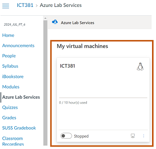

4. Toggle the switch to start your virtual machine.

   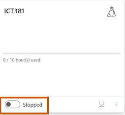

5. Allow some time for the virtual machine to get started and running.

6. After the virtual machine is up and running, click the blue desktop icon. You'll see two options to connect to the virtual machine.

   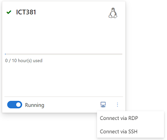

## Connecting to the virtual machine via SSH

Connecting to the virtual machine via SSH does not require downloading any third-party software. Windows users can utilize the built-in Command Prompt or PowerShell, while MAC users can use the terminal to securely access the virtual machine.

SSH is used mainly for terminal access or for troubleshooting the virtual machine when GUI is not available.

1. Click on **Connect via SSH**.

2. You will presented with the sample information.

   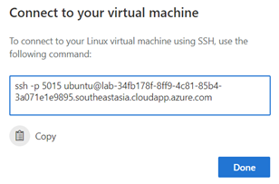

3. Copy the SSH command shown in the box and paste it on PowerShell/Command Prompt/Terminal.

4. For the first time when you connect, you will encounter the message "authenticity of host can't be established", enter **yes** to continue connecting.

5. Enter the Ubuntu login credentials to continue.

6. If the login is successful, you will get the Ubuntu welcome screen.

## Connecting to the virtual machine via RDP (For Windows)

To connect to the virtual machine via RDP:

1. Click on **Connect via RDP**.

2. An RDP file will be downloaded to your computer.

3. Double click on the RDP file to open it.

4. On the Remote Desktop Connection prompt, click **Yes**.

   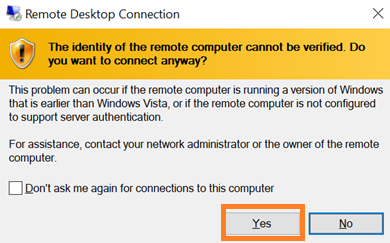

5. Please enter your login credentials for the virtual machine.

   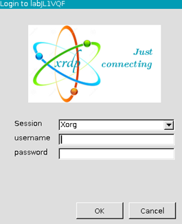
   
   The default login credential for the virtual machine.  
   username: ubuntu  
   password: ICT381ubuntu

6. Upon successful login, the virtual machine desktop will be shown.

## Installing Microsoft Remote Desktop (For MAC)

MAC users should install the Microsoft Remote Desktop application, which is crucial for connecting to the remote virtual machine.

* Open App Store on your MAC and search for **Microsoft Remote Desktop**.

  > NOTE: Please take note of the compatability version of this application. It requires macOS 12.0 and above.

  [https://apps.apple.com/us/app/microsoft-remote-desktop/id1295203466](https://apps.apple.com/us/app/microsoft-remote-desktop/id1295203466)

  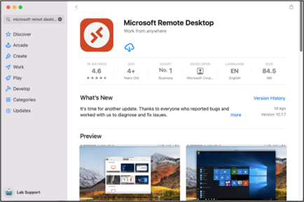

* Install Microsoft Remote Desktop application.

  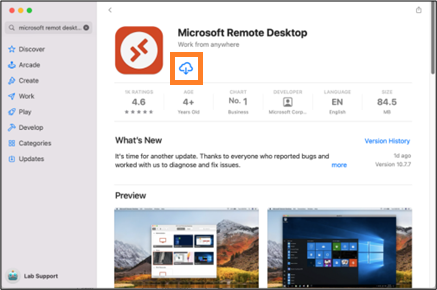

## Connecting to your virtual machine via RDP (For MAC)

To connect to the virtual machine via RDP:

1. Double click on the downloaded RDP file to open it.

2. There will be a prompt message saying that *the identity of the remote PC can't be verified*. Click **Connect** to proceed.

   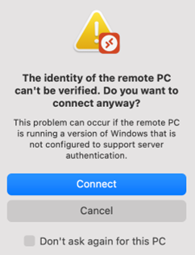

3. Please enter your login credentials for the virtual machine.

   
   
   The default login credential for the virtual machine.  
   username: ubuntu  
   password: ICT381ubuntu

4. Upon successful login, the virtual machine desktop will be shown.

   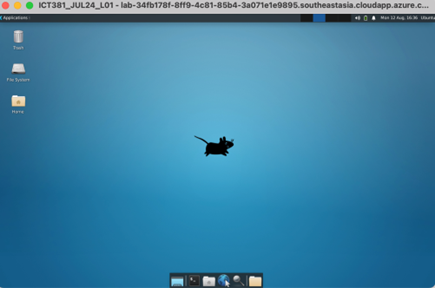

## Stopping your virtual machine

Please return to Azure Lab Services page on Canvas and use the toggle button to shutdown the virtual machine. This is the only method to ensure the virtual machine is turned off, thereby conserving your quota hours.

* On ALS page in Canvas, toggle the button to turn off the running virtual machine.

  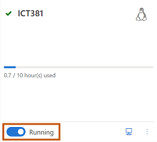

* Ensure the virtual machine is in a **Stopped** state before closing the web browser.

  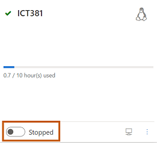

## Viewing your quota hours

In the virtual machine details, you can view the following information:

* Total quota hours allocated
* Quota hours utilized
* Remaining quota hours

    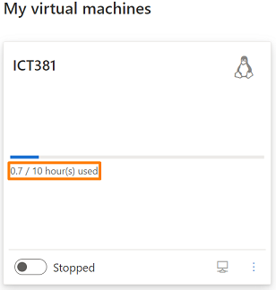

## Login Credentials

Students are <u>**strongly advised**</u> to change their password upon the first login to prevent unauthorized access to their machine.

**Virtual Machine Login Details**  
<u>Azure Lab Services (Ubuntu-22.04)</u> 
username: ubuntu  
password: ICT381ubuntu

Users can use the command `passwd` to change their password.

## Quota System

* Students will be assigned 20 hours per week for the first 6 weeks, followed by 30 hours per week for the remainder of the course. These hours will cover class sessions, virtual labs, independent practice and assignments.

* Quotas will be replenished progressively every Monday at 6pm.

* Unused hours will be forfeited at the end of each week.

* **Illustration**:
    * In Week 2, if student A uses 5 out of 20 hours. The remaining 15 hours will be forfeited. In Week 3, 20 hours will be added to the 5 hours used in Week 2, giving the student a total quota of 25 hours.

* Shutting down the Ubuntu virtual machine does not stop the user quota hours.
    * Students are reminded to turn off the virtual machine from the Azure page in Canvas to avoid continuing to incur user quotas.

* The virtual machine will be automatically shutdown once the user quotas are exhausted.

* For additional quota hours due to genuine needs (eg. extra practice/assignment):
    * Please send a request to your instructor, including the reasons and copy VLI team (vlisupport@suss.edu.sg). Requests will reviewed on a case-by-case basis and additional hours will be granted if approved.

## IT Support

If you have any questions or encounter any problems, please seek clarification through the discussion forum on Canvas. Alternatively, you may contact the administrator via email at vlisupport@suss.edu.sg for further support.