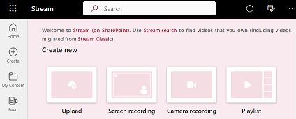
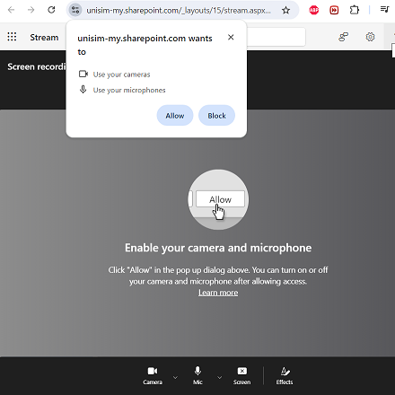
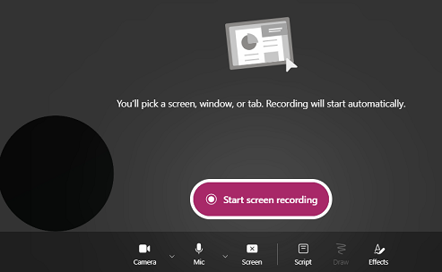
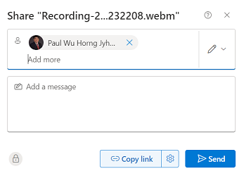
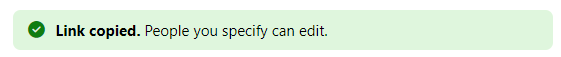

## Assignments

In this course, there are group based and individual assignments. 

For the group based assignment, you will be working within your group of 5 members. Everyone in the team is expected to contribute to the assignment. The elected group leader will be the one responsible to upload the report on behalf of the group.

For individual assignments such as TMA and ECA, you are expected to complete the assignment on your own.

## GBA
For GBA, please take note of the following:

* For Question 1, you are expected to draw a sequence diagram. There is no restriction on the tool you can use. You can consider hand drawn or using free tools such as [draw.io](https://app.diagrams.net/) or [Mermaid](https://mermaid.js.org/).

* For Question 2, store your work in the group GitHub repository. Each member must collaborate, contribute and approve portions of the content in the scenario during the creation process.

* For Question 3, use Jira to create your sprints and user stories. After completing the assignment, export the project excel file and image.

For Question 1 and 3, place the solutions into a Word document and submit in Canvas T group under **GBA01** assignment.

For Question 2, please place your solution in the GitHub repository.

For Question 4, each individual member will submit your individual report in Canvas T group under **GBA01-Q04** assignment.

## TMA

For TMA, these are individual based assignments.

Please ensure you have access to GitHub repository for the three repositories:

- StaycationX
- myReactApp
- automation

For Question 1, create a Word document with your solutions and submit it in the Canvas T group under **TMA01** assignment.

For Question 2, perform and submit your work in your GitHub repositories, including the README file specified in part d.

For part D, you may take reference from [OneMap API documentation](https://www.onemap.gov.sg/apidocs/apidocs).

## ECA

For ECA, these are individual based assignments as well.

We will continue using the GitHub repositories from TMA.

Please submit your work for Questions 1 to 3 in a Word document on Canvas T group **ECA** assignment.

For Questions 4 and 5, submit your work in the GitHub repository. Additionally, record the program run using **Microsoft Stream**, share the recording, and place the recording link in your GitHub repository README file.

Please follow the steps below to use Microsoft Stream for recording:

1. Visit [Microsoft Stream website](https://www.microsoft.com/en-sg/microsoft-365/microsoft-stream) and sign in using your SUSS credentials.

2. On the main page, click **Screen recording**.

   

3. A new browser will open. Please allow access to your camera and microphone by clicking on the **Allow** button.

   

4. On the bottom left, there is circle. This is the camera output. You can click on it and press the X icon to delete it.

   

5. Click **Start screen recording** to start recording.

6. There are three options. Please pick the one that fits you and click **Share**.

    * Chrome Tab
    * Window
    * Entire Screen

7. Perfom your screen recording.
   
8. Once you have completed, click on the **Stop Sharing** button.

9.  A preview of the recording is shown in the browser.

10. Click **Finish** button to save the recording.

11. At the top menu bar, click on the **Share** button.

12. Add your instructor name into the box. Type **Paul Wu Horng Jyh** and click **Copy link**.

    

13. You should see the success message.

    

14. Close the prompt box.

15. Place the recording link into the README file.

## Assignment Deadlines

Each assignment has a deadline. Once the deadline is over, you will lose write access to the assignment GitHub repositories. Please ensure that you submit all your assignments before the deadline. Late submissions will not be entertained.

