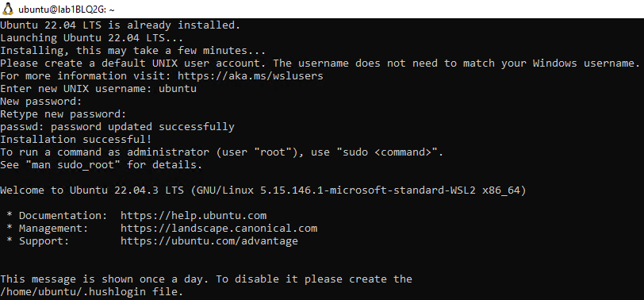
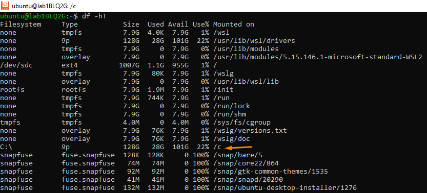
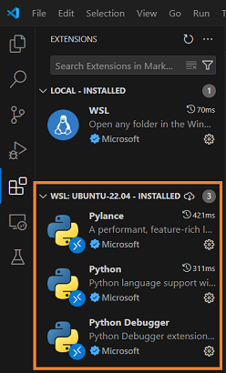
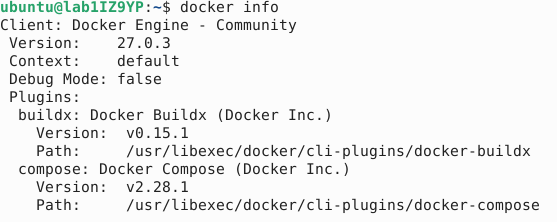

# Lab - Preparing the local lab environment (Windows)

This lab will guide you through the setup of your local machine to prepare for the subsequent lab exercises.

## Pre-requisite
- You have administrative rights to your computer.

## Instructions
The tasks for this lab are as follows:

#### Tasks for WSL:
* Installing WSL
* Configuring accesssing Windows files in WSL

#### Common Tasks between WSL and ALS:
* Installing python pip and virtual environment in WSL
* Installing Firefox in WSL
* Installing MongoDB Community Edition in WSL
* Starting MongoDB and enabling it to start on boot
* Downloading and installing MongoDB Compass
* Downloading and installing VSCode
* Installing extensions in VSCode IDE
* Downloading and Installing Docker Engine in WSL
* Installing Nginx in WSL

#### Tasks for Windows:
* Downloading and Installing Putty
* Downloading and Installing Windows X Server


## Task 1: Installing WSL

Pre-requisite: You must be running Windows 10 version 2004 and higher (Build 19041 and higher) or Windows 11.

For older versions of Windows, you can refer to the [Microsoft documentation](https://learn.microsoft.com/en-us/windows/wsl/install-manual) for manual install.

1. Right click on the Windows Start Menu and click Windows Powershell with Admin mode.

2. Run the following command to install Ubuntu 22.04 distribution in Windows Subsystem for Linux (WSL). Click **Yes** if there are prompts from User Account Control.

   ```powershell
   wsl --install -d Ubuntu-22.04
   ```

   

3. Reboot your computer when prompted.

4. The Ubuntu 22.04.3 LTS window will appear and display the message **Installing, this may take a few minutes...**.

5. You will be prompted to enter a username and password. This will be your default user account for WSL.

   |Field|Value|
   |---|---|
   |new UNIX username| ubuntu|
   |New Password| Your preferred password|
   |Retype new password| Re-enter your preferred password|

6. After user creation, you should see the following sample screen.

   

## Task 2: Configuring accessing Windows files in WSL

1. Open WSL Terminal.

2. Create a file at **/etc/wsl.conf**.

   ```bash
   sudo nano /etc/wsl.conf
   ```

3. Append the following contents into the file on a new line.

    ```bash
    [automount]
    root = /
    options = "metadata"
    ```

4. Save by pressing `Ctrl+O` first, then `Enter`.

5. Exit the file by pressing `Ctrl+X`.

6. Shutdown WSL by entering this command in Windows Powershell.

   ```powershell
   wsl --shutdown
   ```

7. Launch the Ubuntu WSL again.

8. Enter the command to view the filesystem.

   ```bash
   df -hT
   ```

    
    
9. Notice that you can now access your local drives by navigating to the `<drive letter>`.
 
   ```bash
   # for instance, to access your C drive.
   cd /c
   ```    

## Task 3: Installing python pip and virtual environment in WSL

1. Open WSL Terminal.

2. Install python pip and virtual environment with the following command:

   ```bash
   sudo apt-get update
   sudo apt-get install python3-pip python3-venv -y
   ```

## Task 4: Installing Firefox in WSL

Firefox is packaged as a Snap app instead of a traditional DEB version to provide better isolation and security. However, drawbacks of using Snap may include potential issues with software features not working properly within the sandboxed environment. To ensure compatibility with Selenium testing, it is necessary to use the DEB version of Firefox as Snap may not work for this purpose.

1. Open Terminal.

2. Create an APT keyring.

   ```bash
   sudo install -d -m 0755 /etc/apt/keyrings
   ```

3. Import the Mozilla APT repo signing key.
   
   ```bash
   wget -q https://packages.mozilla.org/apt/repo-signing-key.gpg -O- | \
   sudo tee /etc/apt/keyrings/packages.mozilla.org.asc > /dev/null
   ```

4. Add the Mozilla signing key to your sources.list file.

   ```bash
   echo "deb [signed-by=/etc/apt/keyrings/packages.mozilla.org.asc] \
   https://packages.mozilla.org/apt mozilla main" | sudo tee -a /etc/apt/sources.list.d/mozilla.list > /dev/null
   ```

5. Set the Firefox package priority to ensure Mozilla’s Deb version is always preferred. If you don’t do this the Ubuntu transition package could replace it, reinstalling the Firefox Snap.

    ```bash
    echo -e 'Package: *\nPin: origin packages.mozilla.org\nPin-Priority: 1000'  \
    | sudo tee /etc/apt/preferences.d/mozilla
    ```
6. Reload the local package database.

   ```bash
   sudo apt-get update
   ```

7. Install the Firefox DEB in Ubuntu.

   ```bash
   sudo apt-get install firefox --allow-downgrades -y
   ```

## Task 5: Installing MongoDB Community Edition in WSL

1. Open Terminal.

2. Import the public key used by the package management system.

   ```bash
   # Install gnupg and curl if not available.
    sudo apt-get install gnupg curl -y
   ```

   To import the MongoDB public GPG Key, run the following command:

   ```bash
   curl -fsSL https://www.mongodb.org/static/pgp/server-7.0.asc | \
   sudo gpg -o /usr/share/keyrings/mongodb-server-7.0.gpg --dearmor
   ```

3. Create a list file for MongoDB.

   ```bash
   echo "deb [ arch=amd64,arm64 signed-by=/usr/share/keyrings/mongodb-server-7.0.gpg ] \
   https://repo.mongodb.org/apt/ubuntu jammy/mongodb-org/7.0 multiverse" | \
   sudo tee /etc/apt/sources.list.d/mongodb-org-7.0.list
   ```

4. Reload the local package database.

   ```bash
   sudo apt-get update
   ```

5. Install the MongoDB packages.

   ```bash
   sudo apt-get install -y mongodb-org
   ```

## Task 6: Starting MongoDB and enabling it to start on boot

1. In WSL, enter the following command to start MongoDB.

   ```bash
   sudo systemctl start mongod
   ```

2. To enable MongoDB to start on boot, enter the following command.

   ```bash
   sudo systemctl enable mongod
   ```

## Task 7: Downloading and installing MongoDB Compass

1. Navigate to the [MongoDB Compass](https://www.mongodb.com/try/download/compass) website.

2. Click on the green **Download** button.

3. Run the installer and follow on-screen instructions to install MongoDB Compass.


## Task 8: Downloading and installing VSCode

1. Navigate to the [Visual Studio Code](https://code.visualstudio.com/) website.

2. Click on **Download for Windows**.

3. Run the installer and follow on-screen instructions to install VSCode.


## Task 9: Installing extensions in VSCode IDE

1. Launch VSCode.

2. Click on the >< icon on the bottom left corner to open a remote Window.

3. Choose **WSL** from the dropdown list.

4. Click **Extensions** on the left menu bar.

5. Search for **Python** and click **Install**.

6. You should be able to view that the Python extension is installed under WSL Ubuntu 22.04 as shown in the screenshot below.

   

7. You may consider installing other extensions that may help you in the subsequent labs.

    -   [Live Share by Microsoft](https://marketplace.visualstudio.com/items?itemName=MS-vsliveshare.vsliveshare)
    -   [YAML by Red Hat](https://marketplace.visualstudio.com/items?itemName=redhat.vscode-yaml)
    -   [Ansible by Red Hat](https://marketplace.visualstudio.com/items?itemName=redhat.ansible)
    -   [HashiCorp Terraform by HashiCorp](https://marketplace.visualstudio.com/items?itemName=HashiCorp.terraform)
    -   [Git Graph by mhutchie](https://marketplace.visualstudio.com/items?itemName=mhutchie.git-graph)
    -   [GitHub Pull Requests by Github](https://marketplace.visualstudio.com/items?itemName=GitHub.vscode-pull-request-github)

## Task 10: Downloading and installing Putty

1. Navigate to the [Putty](https://www.chiark.greenend.org.uk/~sgtatham/putty/latest.html) website. The latest version of Putty at the time of writing is `0.81`.

2. Click on the 64-bit x86 MSI Windows installer link to download.

3. Run the installer and follow on-screen instructions to install Putty.

## Task 11: Downloading and installing Windows X Server

1. Click on this [link](https://github.com/marchaesen/vcxsrv/releases/download/21.1.10/vcxsrv-64.21.1.10.0.installer.exe) to download Windows X Server.

2. Run the installer and follow on-screen instructions to install Windows X Server.

3. After installation, click on the **XLaunch** shortcut on the Windows Menu.

4. Under **Display Settings**, leave everything as default and click **Next**.

5. Under **Client startup**, leave everything as default and click **Next**.

6. Under **Extra settings**, leave everything as default and click **Next**.

7. Under **Configuration complete**, click **Finish**.

8. Under **Windows Security Alert** prompt, click **Allow access**.

## Task 12: Downloading and Installing Docker Engine in WSL

1. Open **Terminal**.

2. Install using the convenience script provided by Docker.

   ```bash
   curl -fsSL https://get.docker.com -o get-docker.sh
   sudo sh get-docker.sh
   rm -rfv get-docker.sh
   ```

3. Add `ubuntu` user to the docker group.

   ```bash
   sudo usermod -aG docker ubuntu
   ```

4. In Windows, open a Powershell Window and enter the command below to shutdown the WSL instance.

   ```powershell
   wsl --shutdown
   ```

5. Press the Windows Start button to search for **WSL** and launch the instance by clicking on WSL.

6. Once the WSL instance has started, run the command `docker info` to ensure there are no errors.

   

---

## Task 13: Installing Nginx in WSL

1. Open **Terminal**.

2. Run the following to install Nginx.

   ```bash
   sudo apt-get install nginx -y
   ```

3. To verify that Nginx has been installed, enter the following:

   ```bash
   nginx -v
   ```

   It should return the version of Nginx installed.

## Need help in troubleshooting WSL?

Please visit this link to troubleshoot WSL installation: [Troubleshooting WSL](https://learn.microsoft.com/en-us/windows/wsl/troubleshooting)

---

**Congratulations!** You have completed the lab exercise.