# Lab - GitHub

## Exercise 1: Signing up for a new personal account

1. Navigate to [https://github.com/](https://github.com/)

2. Click **Sign Up**.

3. During sign up, you will be asked to provide your email address. Please register using your SUSS email account.

4. Follow on-screen prompts to create your personal account

## Exercise 2: Setting up username and email address in Git

1. Open **Terminal**.

2. Set a Git username.

   ```bash
   git config --global user.name "<enter your preferred git username>"
   ```

3. Set a Git email.

   ```bash
   git config --global user.email "<enter your email address here>"
   ```

4. To confirm that you have set the Git username and email correctly, enter the following command:

   ```bash
   git config --global --list
   ```

## Exercise 3: Create repository on Github

Learn how to create a new repository on Github website.

1. Visit GitHub and login to your own account.

2. In the upper-right corner of any page, select + , then click **New Repository**.

3. Enter a short memorable name for your repository.

4. Optionally, add a description for your repository.

5. For repository visibility, choose **Private**.

6. Click **Create repository**.

Using the above steps, please create 3 empty repositories with the following given names.

*  StaycationX
*  automation
*  myReactApp

## Exercise 4: GitHub SSH Keys

SSH keys provides a secure and efficient means of accessing GitHub without providing your username and personal access token (PAT). You can generate a SSH key and add the public key to your Github account to establish a secure connection between your computer and Github.

1. In the terminal, please enter the following command to generate a pair of SSH keys.

   ```bash
   ssh-keygen
   ```
   Please press **Enter** to accept defaults for the prompt.

### Add SSH keys to GitHub

1. Login to your Github account.

2. Click on your profile picture in the top right corner and select **Settings**.

3. In the **Access** section of the sidebar, click **SSH and GPG keys**.

4. Click **New SSH key**.

5. In the **Title** field, add a descriptive label for the new key.

6. For key type, select **Authentication Key**.

7. In the **Key** field, paste the contents of the public key. 

   > NOTE: The public key is stored in /home/ubuntu/.ssh folder. The file name for the public key is `id_rsa.pub`.
   

8. Click **Add SSH key**.

9. You should be able to view that your key is added successfully if there is no error.

Use `ssh-keyscan` command to scan SSH public host key of GitHub and append it to the `known_hosts` file located in your home .ssh directory. This file helps secure your SSH connections by verifying the identity of the server you are connecting to.

```bash
ssh-keyscan github.com > /home/ubuntu/.ssh/known_hosts
```

## Exercise 5: Mirror repositories to your own repository

To create a copy of the course repositories under yor account with write access, please follow the steps provided.

1. In your terminal, enter the following commands:

   ```
   git clone --bare <the github repository link>
   cd <repository directory>
   git push --mirror <new github repository link>
   rm -rf <the cloned link>
   ```

   For example to clone and mirror the staycationX repository:

   ```bash
   git clone --bare git@github.com:ict381/staycationX
   cd staycationX.git
   git push --mirror git@github.com:USERNAME/staycationX #(push to new repository created under Exercise 3)
   cd ../
   rm -rf staycationX.git
   ```

   Repeat the above steps for all the course repositories namely `StaycationX`, `automation` and `myReactApp`.

2. To start working on the mirror-ed repository, follow the steps.

   ```bash
   # In this example, we are accessing the StaycationX repository.

   git clone git@github.com:USERNAME/staycationX
   cd staycationX
   ```

## Exercise 6: Basic Github Commands

To get started with Git, these are the most commonly used commands that you need to know.

* git init: Used to initialize a new git repository
 
* git add: Used to add files to the staging area for commit

* git commit -m "message": Used to commit staged changes

* git remote add <variable name><url>: Connects your local repository to the remote server.

* git push: Sends the committed changes from local to the remote repository.

* git pull: Fetch and merge changes from the remote repository to local repository.

* git log: List the version history for the current branch.

* git clone [url]: Retrieve an entire repository from a hosted location via URL

* git branch: List your branches.

* git switch -c [branch] / git checkout -b [branch]: Creates and switches to the new branch.

* git switch [branch] / git checkout [branch]: Switch to the specified branch.

* git merge [branch]: Merge the specified branch's history into the current one.


## Exercise 7: Setup Branch Protection Rule (Optional)

1. On Github website, navigate to the main page of repository.

2. Under the repository name, click on **Settings**.

3. In the "Code and automation" section of the sidebar, click **Branches**.

4. Next to "Branch protection rules", click **Add rule**.

5. Under **Branch name pattern**, enter the branch name or pattern that you want to protect. In our case, it would be **main**.

6. Under "Protect matching branches", select **Require a pull request before merging**.

7. Select **Require approvals**.

8. Leave the rest of the options as defaults

9. Click **Create**.

## Exercise 8: How to create Pull requests?

Pull requests allows you to share work you have done on a branch with your team mates, potentially gather feedback on the work and finally integrate that work into the project.

The pull request process can be broken into several steps.

1. Create a branch of the repository locally and add your work by making commits on the new branch.
2. Push the new branch to Github.
3. Create a pull request on Github.
4. Get the pull request reviewed by the assigned personnel and potentially get feedback.
5. Get the pull request approved.
6. Merge the pull request.
7. Delete the branch created from Step 1.
8. Pull the changes to sync your local repository with the remote repository.

To get started, you may create a dummy repository and use it as a starting point for this practice.

In this example, a repository named demo_pull is created on Github.

After which, please complete the first two steps.

A sample reference to start off for the first two steps.
```bash
git init -b main
echo 'Add Red' > rainbow.txt # add some dummy text
git add rainbow.txt # add file to staging area for commit 
git commit -m "first upload"
git remote add origin git@github.com:USERNAME/demo_pull.git
git push -u origin main 
git switch -c feature1 # create and switch to the new branch called feature1
echo 'Add Olive' > rainbow.txt
git add rainbow.txt
git commit -m "add color"
git push -u origin feature1 # push the changes to the feature1 branch

```
#### From Web (Github)

Assuming you have completed the first two steps. To open a pull request, follow the steps.

1. Click **Compare & pull request** to create a pull request for the associated branch.

   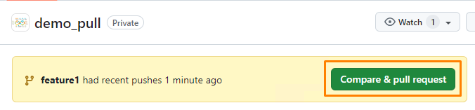

2. NOTE: Use the base branch dropdown menu to select the branch that you would like to merge your changes into, then use the compare branch drop-down menu to choose the branch where you made your changes in.
3. Enter a title and description for your pull request.
4. Under the **Reviewers** section, click on the gear icon and select from the list of reviewer(s) that you are asking to review the change.
5. To create a pull request that is ready for review, click **Create pull request**.

   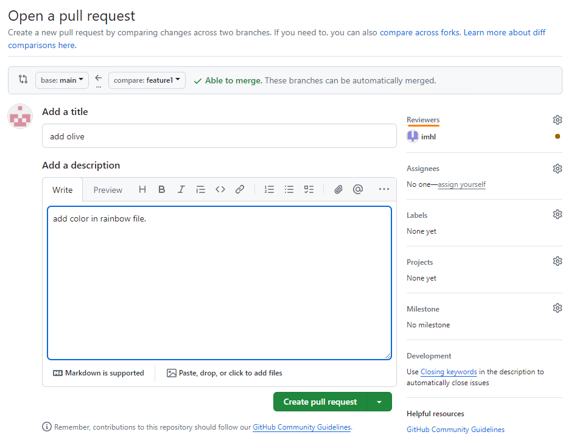

6. You should see the message that review is required and merging is blocked.

---

Next, please get the reviewer to login to review the changes.

---
7. Click on the notification box icon (which is just beside the your profile logo).

   

8. Click on the record that says review requested.
9. Click on **Add your review** button.

   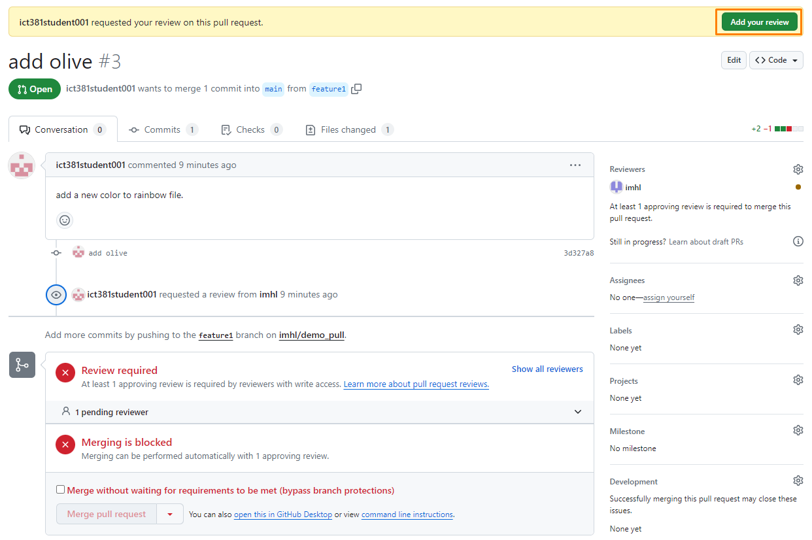

10. You can add your comments on a particular line by clicking on the blue + icon.
11. After you have completed your review, click on the **Review changes** button.
12. Write a review comment and click on the relevant button followed by clicking the **Submit review** button. In this example, select the `Approve` button.

    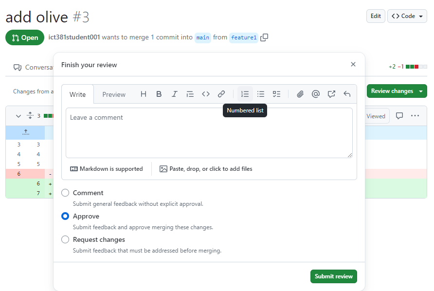

13. Now, when the changes are approved. you can merge the pull request. Click on **Merge pull request** button.

    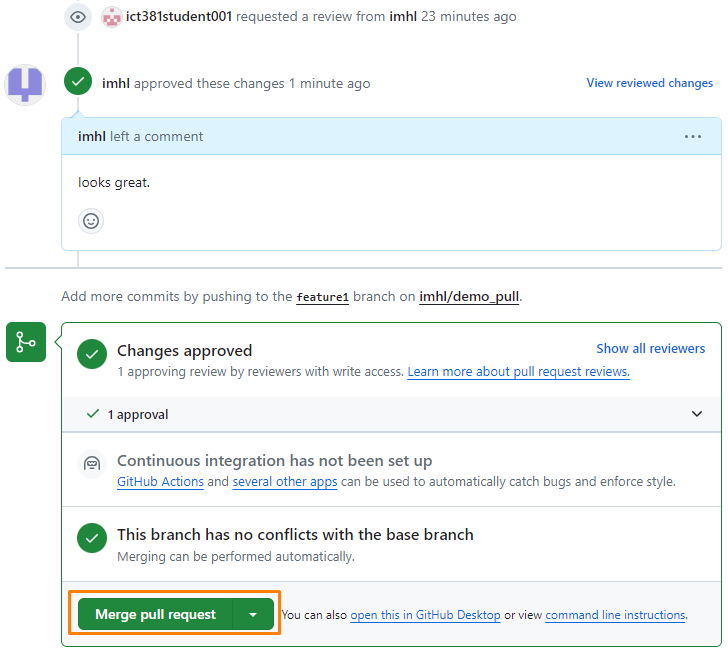

14. Click **Confirm merge** to merge it.

15. Once successfully merged, you are presented the option to delete the branch.

16. Click **Delete branch** to delete the branch.

    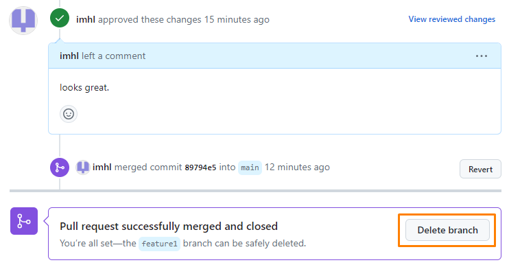

17. Remember to do the following back at your local repository.

    ```bash
    # switch back to main to pull the changes to synchronise the repositories
    git switch main
    git pull
    # to remove the deleted branch from your local repository that was deleted from remote repository
    git fetch -p
    # remove local branch from your repository
    git branch -d <local branch name>
    ```

#### From VSCode GitHub Pull Requests Extension

Assuming you have completed the first two steps. To open a pull request, follow the steps.

1. In VSCode, click on the **Github Pull Request** extension icon from the left menu.

2. Click on the first icon to create a pull request.

3. Enter a title and description for your pull request.

4. Click on **Create** button.

   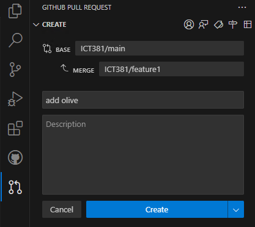

5. A new page with the pull request details will appear on the right.

   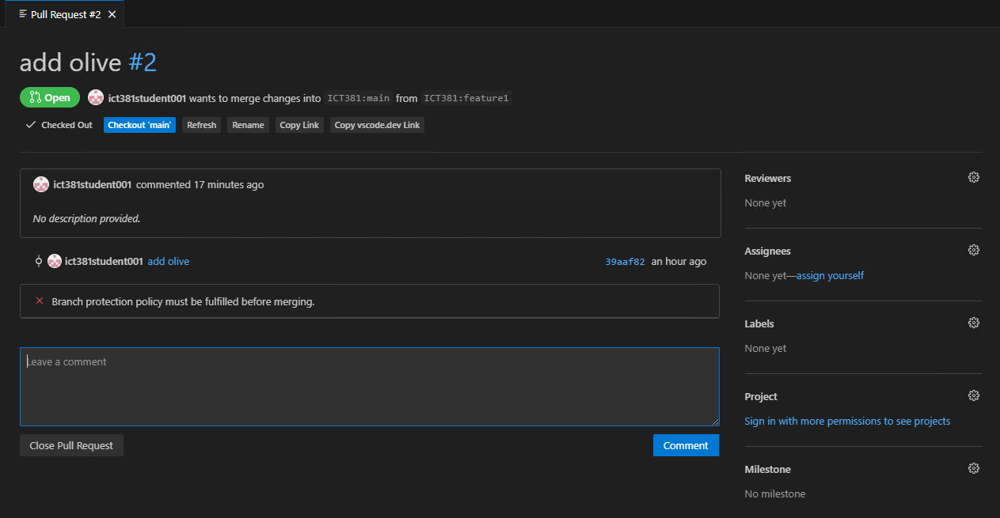

6. Under the **Reviewers** section, click on the gear icon and select from the list of reviewer that you are asking to review the change.

---

Next, please get the reviewer to review the changes.

---

7. From the Pull Requests extension, expand **Waiting For My Review** tree.

8. Click on the commit and expand the tree, followed by clicking on the **Description**.

   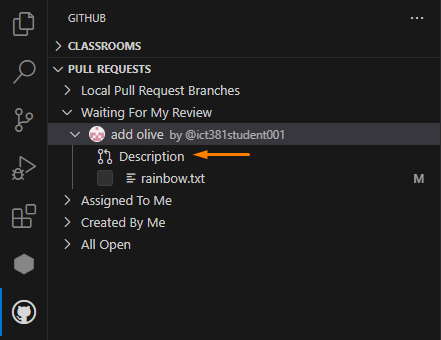

9. A pull request details page will appear on the right.

10. To review the changes, click on the file and you can click on the + button to add your comments.

11. Back to the pull request page, there are three options for you to pick. In this example, I will select the **Approve** button.

    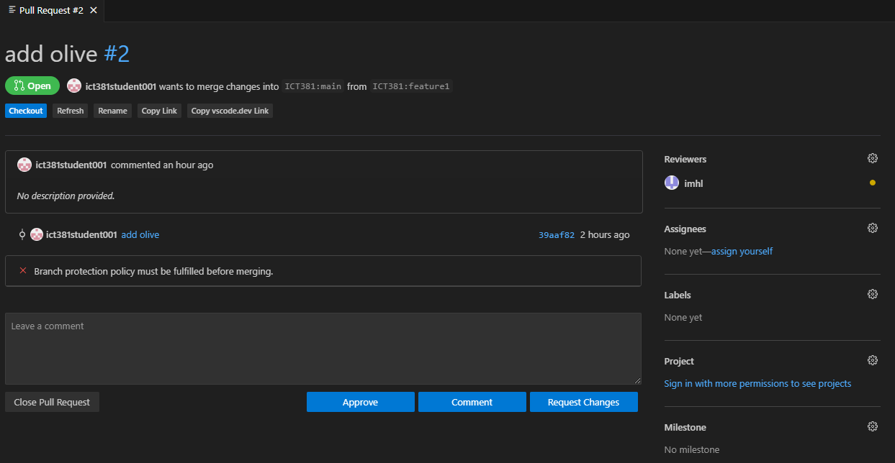

12. Now, when the changes are approved. you can merge the pull request. Click on **Merge Pull Request** button.

    

13. Click **Create Merge Commit**.

    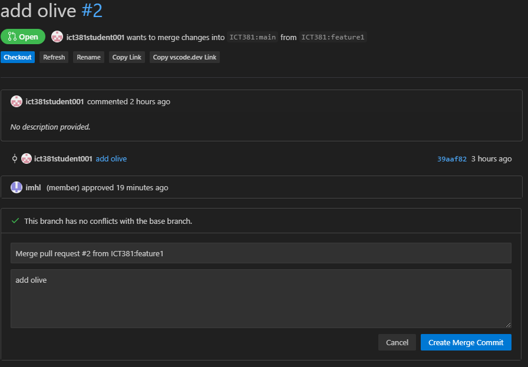


14. Once successfully merged, you are presented the option to delete the branch.

15. Click **Delete branch** to delete the branch.

16. A prompt will appear. Ensure that it is the correct branch and click **OK** to proceed.

    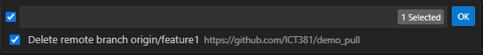

17. You can see the message displayed that the branch has been deleted.

    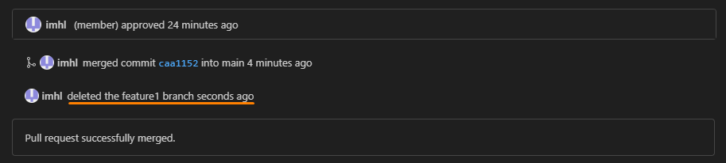

18. To delete the local branch, click **Delete branch**.

19. A prompt will appear. Ensure that it is the correct branch and click **OK** to proceed.

    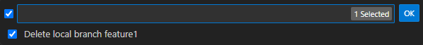


## Exercise 9: Using Git in VSCode

VSCode has integrated source control management (SCM) and includes Git support out-of-the-box.

Refer to the documentation links provided to familiarize yourself on how to use Git in VSCode.

-  [SCM Overview](https://code.visualstudio.com/docs/sourcecontrol/overview)
-  [Introduction to Git](https://code.visualstudio.com/docs/sourcecontrol/intro-to-git)
-  [Collaborate on GitHub](https://code.visualstudio.com/docs/sourcecontrol/github)


--- 

### References:

1. [Learning Git by Anna Skoulikari](https://learning.oreilly.com/library/view/learning-git/9781098133900/)

2. [GitLab Cheatsheet](https://about.gitlab.com/images/press/git-cheat-sheet.pdf)

---

Congratulations! I hope this exercise will enhance your understanding of Git.