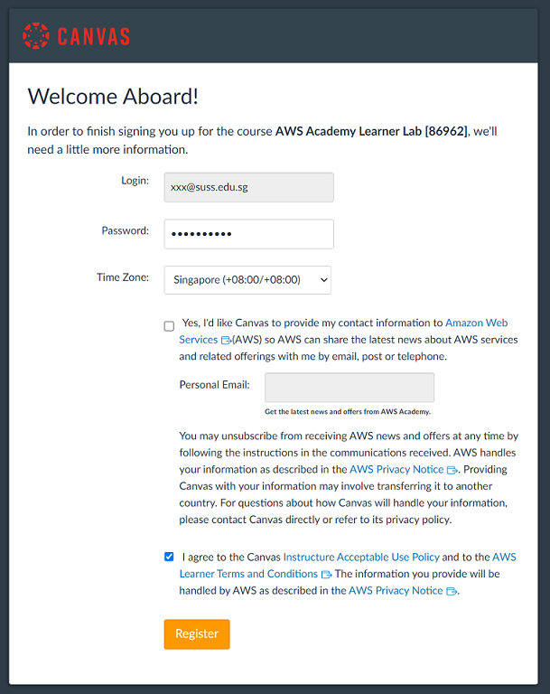

# Lab - AWS Academy Canvas LMS

In this lab, we will explore accessing AWS Academy Canvas LMS system and the AWS Learner lab.

Your course instructor will be enrolling you to the AWS Academy Canvas LMS.

Once you are enrolled:

1) You will receive an email from AWS Academy with the subject title named `"Course Invitation"`.

   

2) Click on the **Get Started** button.

3) Click on the **Create My Account**. Please note that this AWS Academy Canvas LMS is not the same as your SUSS Canvas LMS.

   

4) On the **Welcome Aboard!** page, please set your account password, time zone and tick the checkbox to agree with the terms and conditions of using AWS Learner lab.

   

5. Click **Register** to proceed.

6. You will be brought to the home page of the AWS Academy with the course enrolled showing on the dashboard.

   

---

Please update the settings to replace the email address with your name for easier identification.

To do that, please follow the steps:

1. Click on **Account** button on the left menu bar followed by **Settings**.

2. Click **Edit Settings** that is located on the right.

3. Enter your name in the `Full Name` field and duplicate it to `Display Name` and `Sortable Name` field.

4. Click **Save** button to save the changes.

---

Congratulations! You have come to the end of this lab. You have successfully accessed the AWS Academy Canvas LMS system.