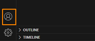

# GitHub Classroom

In this course, there are group based and individual assignments that require you to submit your codes in Github Classroom.

Your instructor will provide you with the assignment invitation links which you would need to access the repository.

Now, We will take you through the steps to access your assignment repository once you have received the links.

Before you start, please ensure that you have the following:
*   A GitHub account
*   You have installed Github Classroom extension in VSCode

If you have not done so, please refer to 
*   `Lab_0A.md` or `Lab_0B.md` for installation of the GitHub classroom extension depending on your platform.
*   `Lab_0C.md` to create your GitHub account.

To start, please do the following:

1. Open VSCode application.

2. For Windows users, please connect to your Ubuntu WSL first. You can achieve this by clicking on the **Open a Remote Window** blue button that is located on the bottom left of the VSCode application. 

2. On the left menu, click on the **Accounts** icon.

    

3. Click **Backup and Sync Settings...**.

4. Click **Sign in** button.

5. Select **Sign in with GitHub**.

6. A web browser will appear, enter your GitHub credentials and click **Sign in**.

   

7. Click **Continue** to proceed.

8. When you see this prompt, click **Open**. Please note that this prompt is from Microsoft Edge browser. It may appear differently from other web browsers.

    

9. Click on the **Accounts** button again on the left menu.

10. You should see your GitHub account listed.

## Accessing Group Assignment

1. Access the group based assignment link that is provided by your instructor.

2. Before accepting the group assignment, you need to create a team if your team members have not done so. If your team has been created, click on the team to join.

    ### New team (no existing team)

    The name format of the team should be **GBAX** where `X` refers to the number of the team. Please perform this step correctly.

    > You can find your group number in Canvas T group. Under People, click on **Groups**.

    Once you have entered the name, click **+Create team**.

    

3. You should see a success message saying that the team has been created. Click on **Accept this assignment** to continue.

   

   ### Existing team

   If your team has been created, click on the **Join** button.

   

4. You should be able to see the link of your team's created repository.

   

5. Click on **Open in Visual Studio Code** button.

6. A prompt will appear to ask for permission to open in VSCode. Click **Open**.

   This prompt is from Microsoft Edge browser. It might appear differently in different web browsers.

   

7. Check the option **Do not ask me again for this extension** and click **Open**.

   

8. Click **Allow**.

   

9. In VSCode, if the signing to github.com is stuck in a loop, refresh the web browser screen again.

10. On the **Do you trust the authors of the files in this folder** prompt, click **Yes, I trust the authors**.

11. On the VSCode left menu, you should be able to access the group repository followed by the assignment details such as the deadline and who is in the team.

    

## Accessing Individual Assignment

1. Access the individual based assignment link that is provided by your instructor.

2. Click **Accept this assignment**.
 
   

3. You should be able to see the link of your own created repository.

   

4. Click **Open in Visual Studio Code** button.

5. Click **Open** from the browser prompt.

6. Click **Allow**.

7. On the VSCode left menu, you should be able to access your own repository together with the assignment deadline.

---

## For subsequent access
If you need to access the assignment folder/files in the future, you can find them at `/home/<USERNAME>/github-classroom/ict381/<ASSIGNMENT_FOLDER>`.

Alternatively, you can access it via the **GitHub** button that is located on the VSCode left menu. Hover your mouse over to the assignment and click on the **folder** icon to open the assignment.