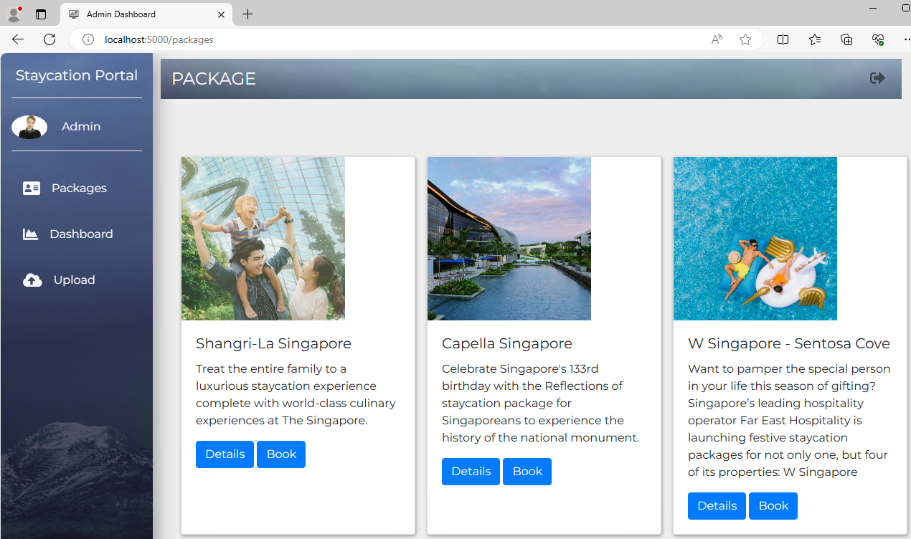
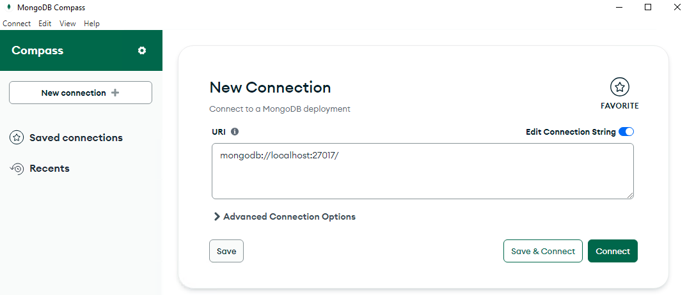
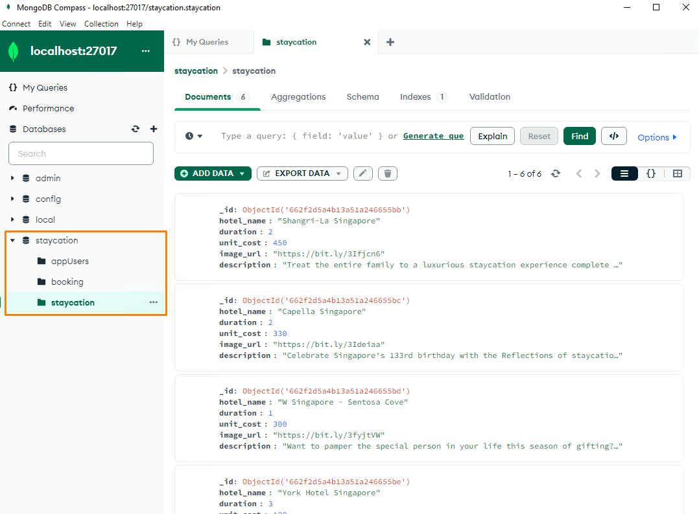

# Lab - How to Run StaycationX?

In this lab, you will learn how to run StaycationX, install dependencies, set up a virtual environment and load the database with data. It is essential to familiarize yourself with these tasks as we will be using the StaycationX application extensively throughout this course.

## Pre-requisites
- Completed LAB_0A or LAB_0B depending your platform.

## Instructions
We will be performing these tasks in your local development environment.

1. Clone the StaycationX repository
2. Create virtual environment
3. Install libraries dependencies in virtual environment
4. Run the StaycationX repository
5. Populate the database with data
6. View the MongoDB database via MongoDB Compass

## Task 1: Clone the StaycationX repository

1. Open Terminal.

2. Clone the StaycationX repository into your user home folder.

   ```bash
   cd /home/ubuntu
   git clone git@github.com:USERNAME/staycationX
   ```

## Task 2: Create virtual environment

1. Navigate the staycationX folder.

   ```bash
   cd /home/ubuntu/staycationX
   ```

2. Create virtual environment.

   ```
   python3 -m venv venv
   ```

3. Activate virtual environment.

   ```
   source venv/bin/activate
   ```

## Task 3: Install libraries dependencies in virtual environment

1. Use pip to install the libraries listed in `requirements.txt` file.

   ```bash
   pip install -r requirements.txt
   ```

## Task 4: Run the StaycationX repository

1. Run `start.sh` file in the folder to start the StaycationX app.

   ```bash
   ./start.sh
   ```

2. Open web browser and visit `http://localhost:5000`. You should see the StaycationX website.

## Task 5: Populate data in the database

### Step 1: Register an admin user

1. Click **Register** on the home page.

2. Fill in the register form with the following details and click **Submit**.

   |Field|Value|
   |---|---|
   |Email| admin@abc.com|
   |Password| 12345|
   |Name| Admin|

3. In the Login page, enter the `email` and `password` that you have entered in the previous step and click **Submit**.

### Step 2: Populate the database with data

You will need to upload 3 CSV files. They are `booking.csv`, `users.csv` and `staycation.csv`.

The 3 CSV files can be found in StaycationX > app > assets > js folder.

---

Before the `staycation.csv` file can be uploaded, please open the file and check that the text on the last line "Singapore Marriott Tang Plaza Hotel" is spelt correctly. If it is not, please correct the typo and save the file before proceeding to the next step.

---

1. Click **Upload** on the left menu.

2. On the **Upload Recordings** page:

   -  Select **Users** from the dropdown list.
   -  Click **Choose File** and select the `users.csv` file.
   -  Click **Upload**.

   -  Select **Package** from the dropdown list.
   -  Click **Choose File** and select the `staycation.csv` file.
   -  Click **Upload**.

   -  Select **Booking** from the dropdown list.
   -  Click **Choose File** and select the `booking.csv` file.
   -  Click **Upload**.

3. Click **Packages** on the left menu and you should see the list of packages.

   A sample screenshot of the website.

   


## Task 6: View the MongoDB database via MongoDB Compass

1. Launch the MongoDB Compass application.

2. Connect to the MongoDB database with the following URI: `mongodb://localhost:27017`.

   

3. Click **Connect**.

4. You will be able to view the staycation database and the collections.

   


---

**Congratulations!** You have completed the lab exercise. Move on to the next lab exercise!