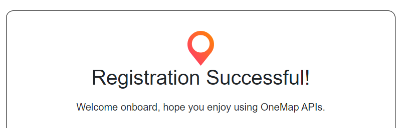
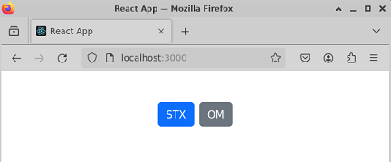
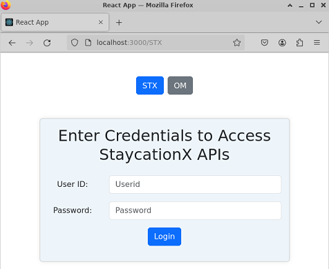
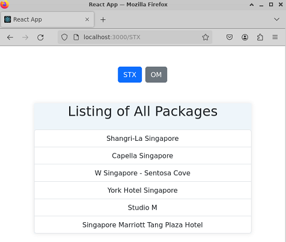
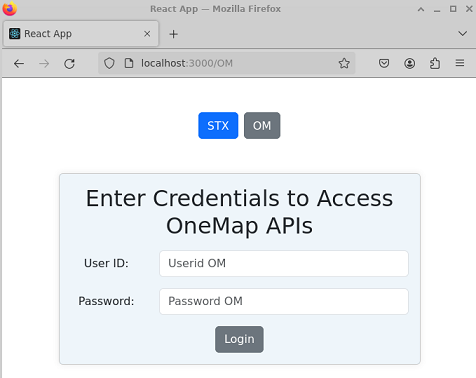
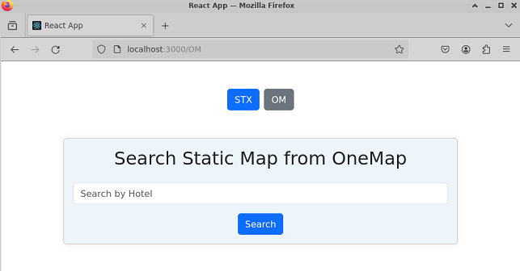
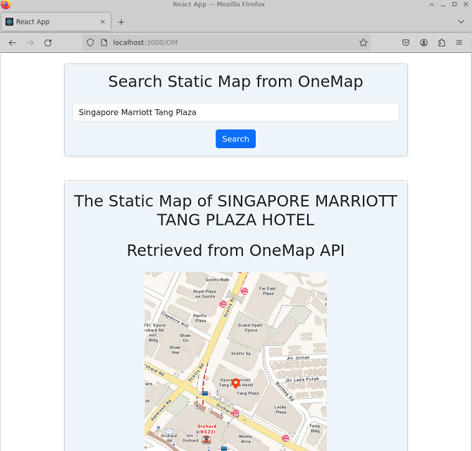

# Lab - Running ReactJS as the API frontend for StaycationX

In this lab, we will be setting up and running ReactJS as the API frontend for StaycationX application. We will also be integrating OneMap API to display static map images of hotels in Singapore.

## Instructions
The main tasks for this lab are as follows:
1. Create OneMap API account
2. Clone myReactApp Repo
3. Install NodeJS and React JS
4. Run the ReactJS app
5. Interact with the app for StaycationX API
6. Interact with the app for OneMap API

## Task 1: Create OneMap API account

1. Visit the [OneMap API Registration](https://www.onemap.gov.sg/apidocs/register) website.

2. Fill in all the necessary details and click **Register**.

3. Under the **Confirm your OneMap API account** page, please do the following:

    - Check your email inbox for the **Confirmation Code**.
    - Create your own password that fufills the criteria that is listed on the website.
    - Click **Register**.

4. You should get the **Registration Sucessful!** message.

   


## Task 2: Clone myReactApp Repo

1. Open a terminal.

2. Clone the `OneMap` branch of the `myReactApp` repository.

    ```bash
    cd /home/ubuntu/
    git clone -b OneMap git@github.com:USERNAME/myReactApp
    ```

## Task 3: Install NodeJS and React JS

Open a terminal and follow the steps given.

1. Download and run the Node.js setup script.

    ```bash
    curl -sL https://deb.nodesource.com/setup_16.x -o nodesource_setup.sh
    chmod +x nodesource_setup.sh
    sudo ./nodesource_setup.sh
    rm -rf nodesource_setup.sh
    ```
2. Press **TAB** to highlight the **CANCEL** button and press **ENTER**.

3. Install Node.js.

    ```bash
    sudo apt install nodejs -y
    ```

4. You can verify the installation by checking the version of Node.js and npm.

    ```bash
    node -v
    npm -v
    ```

5. Navigate to the myReactApp directory.

    ```bash
    cd /home/ubuntu/myReactApp
    ```

6. Install ReactJS package necessary for creating ReactJS projects.

    ```bash
    npm install create-react-app
    ```

## Task 4: Run the ReactJS app

1. To start myReactApp, run this command.

    ```bash
    npm start
    ```

2. The web browser will automatically open and navigate to `http://localhost:3000`.

   

## Task 5: Interact with the app for StaycationX API

Before you start, please ensure that the StaycationX application is running.

1. On the home page, click on the **STX** button.

2. Enter your credentials to access the StaycationX API.

   

3. After logging in successfully, you will be able to view the listings of all packages.

   

## Task 6: Interact with the app for OneMap API

1. On the home page, click on the **OM** button.

2. Enter your credentials in Task 1 to access the OneMap API.

   

3. After logging in successfully, you will be able to search static map using OneMap API.

   

4. You can search for any hotel name in Singapore. For instance `Singapore Marriott Tang Plaza Hotel`.

   

---

**Congratulations!** You have completed the lab exercise.