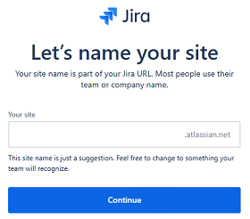
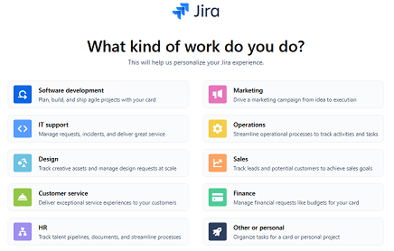
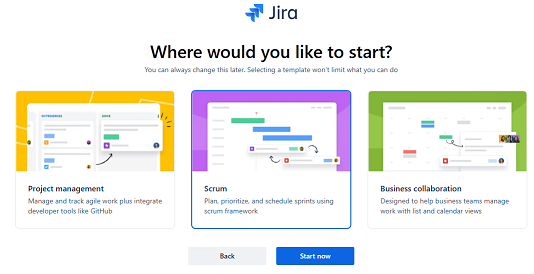
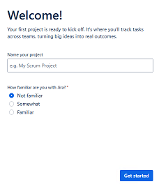
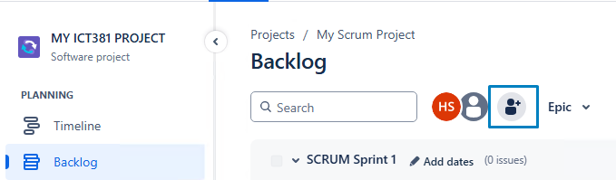
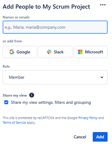
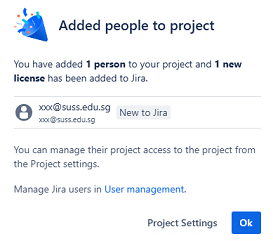
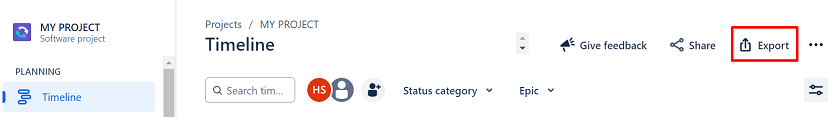
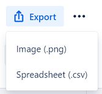

# Lab - Jira

## Task 1: Creating Jira account

1. Navigate to [https://www.atlassian.com/software/jira](https://www.atlassian.com/software/jira)

2. Click on **Get Jira Free**.

3. Enter your SUSS email address and click **Sign up**.

   > NOTE: DO NOT click on the Microsoft icon to create your Jira account.

4. Check your email inbox for the verification code sent by Atlassian.

5. Enter the verification code on the website.

6. On the Add your account details page, enter your `full name` and `password`.

7. Click **Continue** to proceed.

8. On Let's name your site page, enter a **name** for your site.

   

9. Click **Continue** to proceed.

10. On What kind of work do you do? page, select **Software development** and click **Continue**.

    

11. On Where would you like to start? page, select **Scrum** and click **Start now**.

    

12. On Welcome! page, create a **name** for your project and click **Get Started**.
   
    

## Task 2: Invite your team members

1. Click on the **Add people** button.

   

2. On the Connect and find people faster prompt, click **OK**.

3. Under Names or emails field, enter the `email address` of your team members.

   

4. Click on the **Add** button.

5. A message will be displayed to show that the user has been added to the project.

   

6. The added user will recieve an email invite to join the Jira project hence please check the email inbox to accept the invite.

## Task 3: Practice
#### Please refer to your study guide to complete the rest of the exercises.

## Task 4: Exporting your work

After completing your work, it is essential to know how to export it, as you will be required to submit the exported work for your assignment.

To export out your work, please follow the steps:

1. Click **Projects** on the top menu bar and select your own project.

2. Under Planning menu, click **Timeline**.

3. On the top right hand side, click **Export**.

   

4. There are two options from the dropdown list. You would need to generate both file types.

   

5. To generate the CSV file, click on **Spreadsheet(.csv)**. It will be downloaded to your own machine.

6. To generate the image.png file, click on **Image (.png)**.

   * There are 3 fields namely `Timeline view`, `Start Date` and `End Date`.
   * Please make sure to select values for each field that best suit your data.
   * Click **Export** to export image.
   * The file will be downloaded by the web browser.

---

**Congratulations!** You have completed the lab exercise.