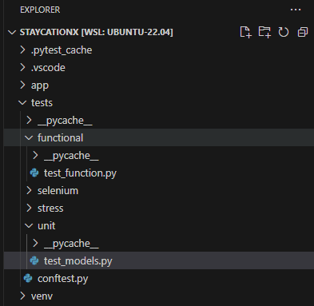
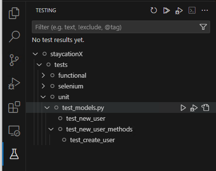
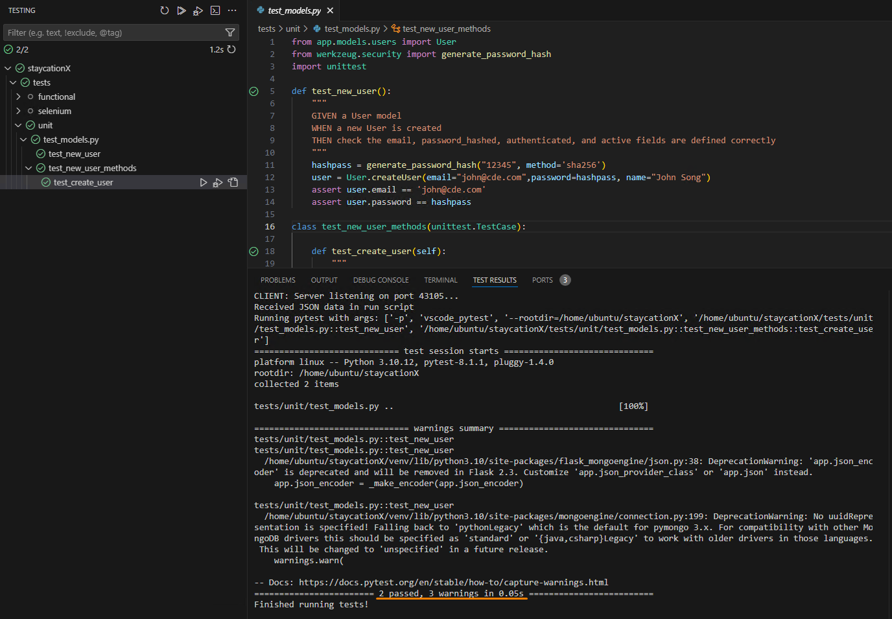
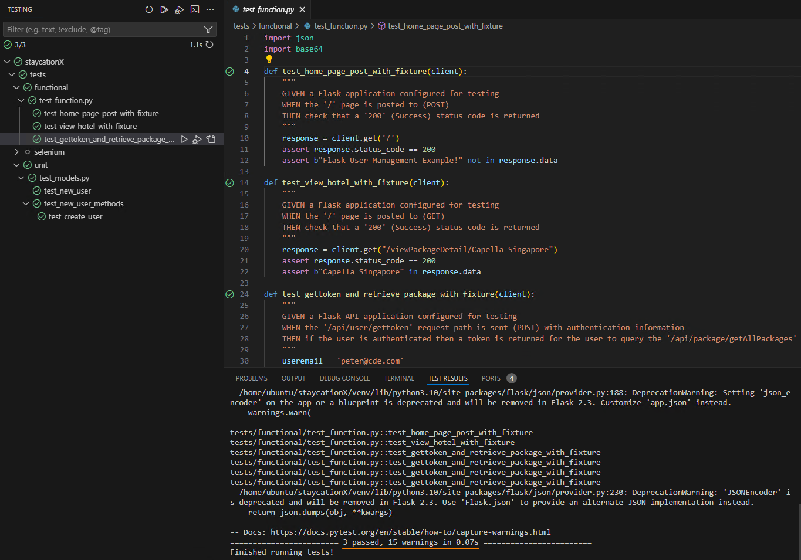

# Lab - Practice UnitTest and Pytest modules for unit and feature testing

In this lab, you will learn how the unit tests and feature tests are implemented for StaycationX.

## Pre-requisites
- Completed Lab_0A or Lab_0B depending on your platform.
- `test` branch of the StaycationX repository.

We will be working this lab within your own local development VSCode environment.

## Instructions
1. Checkout the `test` branch of the StaycationX repo.
2. Running of StaycationX application
3. Populate the database
4. Run Unit testing
5. Run Feature testing


## Task 1: Checkout the `test` branch of the StaycationX repo in VSCode

1. Open VSCode application.

2. Click the <> icon on the bottom left to connect to the remote window which is your WSL. (Only applicable for WSL)

3. On the top menu bar, click on **File** > **Open Folder** and point to the **staycationX** directory.

4. Open a terminal by clicking on **Terminal** > **New Terminal** on the top menu bar.

4. Checkout the `test` branch of the StaycationX repo.

   ```bash
   git checkout test
   ```
    
   > [TIP]
   > Determine your current branch by running the `git branch` command.

## Task 2: Running of StaycationX application

1. Activate the virtual environment and install the additional libraries in `requirements.txt` file.

   ```bash
   source venv/bin/activate
   pip install -r requirements.txt
   ```

2. Ensure that your mongoDB is running.

   ```bash
   sudo systemctl start mongod
   ```

3. Run the StaycationX app.

   ```bash
   ./start.sh
   ```

## Task 3: Populate the database

This section is optional if you have already populated the database.

If you have not populated the database, kindly follow the steps provided under Task 5 in [LAB_1A](https://github.com/imhl/ict381-lab-notes/blob/master/LAB_1A.md).


## Task 4: Run Unit Testing

Please refer to your study guide for a better understanding and explanation of the test cases and their relevant code for Unit and Feature testing.

1. In VSCode, expand the **tests** folder.

2. You will notice that there are different test folders for each type of test.

3. Taking a look at unit test sub-folder, open and study the `test_models.py` file. You should see that there are two test functions.

   

4. To run the tests, click **Testing** icon on the left panel of VSCode. (It looks like a flask icon)

5. Expand staycationX folder and under the `unit` sub-folder, hover your mouse and click on the run button under `test_models.py` to run the test cases.
   
   

   > TIP: You can run the individual test functions by clicking on the run button when you hover your mouse over the function.

6. You should see that the test functions have passed successfully.

   

---

#### NOTE

Please note that when you run the test functions multiple times, you will encounter an error as the user already exists in the database. To resolve this issue, you can use MongoDB Compass to connect to the database and drop the record that was created from the `test_models.py` file.

For test_new_user function, an user with an email `john@cde.com` is created. You can delete this record from the database and try again.

For test_create_user function, an user with an email `jack@fgh.com` is created. You can delete this record from the database and try again.

---

## Task 5: Run Feature Testing

1. Under the `functional` folder, open and study the `test_function.py` file. You should see that there are three test functions.

2. Click on the run button under `test_function.py` to run the test cases.

   > TIP: You can run the individual test function by clicking on the run button when you hover your mouse over the function.

3. You should see the test functions have passed successfully.

   

---

**Congratulations!** You have completed this lab exercise. Do move on to the next lab exercise for selenium testing.