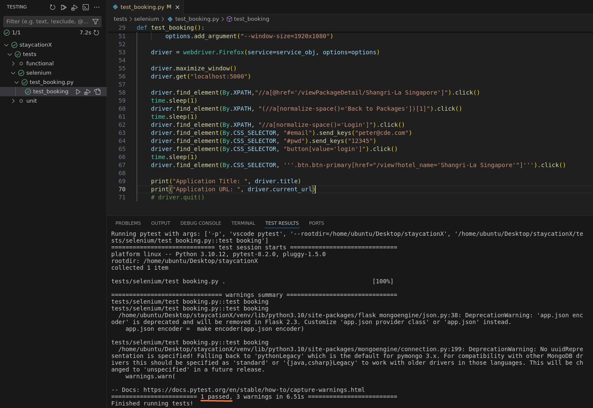

# Lab - Practice Selenium for System Testing

In this lab, we will practice using Selenium. Selenium is a versatile tool for automating web browser interactions, crucial for system testing to ensure web applications meet requirements consistently. Geckodriver serves as a vital bridge between Selenium and Gecko-based browsers like Firefox, enabling seamless automation of Firefox browser actions. It ensures efficient communication between Selenium WebDriver and Firefox instances, streamlining testing processes.

## Pre-requisites
- Completed Lab_0A or Lab_0B depending on your platform.
- `test` branch of the StaycationX repository.
- Database is populated with data.

We will be working this lab within your local development environment.

## Instructions
1. Launch X Server (for Windows ONLY)
2. Running of StaycationX and MongoDB
3. Setup and Run Selenium Test


## Task 1: Launch X Server (for Windows ONLY)

1. From the Windows Start Menu, search for **VcXsrv** folder and click on **XLaunch**.

2. Leave the settings default and click **Next**.

3. On **Finish Configuration** page, click **Finish**.

## Task 2: Running of StaycationX and MongoDB

1. Launch VSCode, Open folder and point to the StaycationX application.

2. Ensure that you are on the `test` branch.

2. Start both the StaycationX application and MongoDB before proceeding with the next task.

## Task 3: Setup and Run Selenium Test

Please refer to your study guide for a better understanding and explanation of the test case and their relevant codes for Selenium testing.

1. Expand the `tests` folder.

2. Under the selenium sub-folder, open and study the `test_booking.py` file.

3. In the test_booking function, when creating a Service object for the geckodriver executable, you will need to specify the path to the geckodriver executable.

   ```python
   service_obj = Service(<insert the path of the geckodriver>)

   # For instance
   # service_obj = Service("/home/ubuntu/Desktop/staycationX/geckodriver")
   ```

4. Open a **Terminal**.

5. Run the following command to add the executable permission to geckodriver which allows it to be run as a program.

   ```bash
   chmod +x geckodriver
   ```

6. To run the test, click **Testing** icon on the left panel of VSCode. (It looks like a flask icon)

7. Expand staycationX folder and under the `selenium` sub-folder, hover your mouse and click on the run button under `test_booking.py` to run the test function.

8. You will notice a Firefox browser window opening and performing the browser actions automatically.

9. Once the test is completed, you will see that the test function has passed successfully.

   

10. You may close the Firefox browser window after the test is completed.

---

**Congratulations!** You have completed this lab exercise.