# Lab - Provisioning of AWS EC2 Virtual Machines

This lab will guide you through the process of provisioning an EC2 instance in AWS. You will learn how to create a new EC2 instance, connect to it, and install all the necessary software dependencies to run the StaycationX application.

## Pre-requisites
- AWS Academy Learner Lab 
> [!IMPORTANT]
> Please contact your instructor for assistance if you do not have an AWS Academy Learner Lab account.

## Instructions
The main tasks for this lab are as follows:
1. Login and launch AWS Learner Lab
2. Create and AWS EC2 instance
3. Accessing EC2 based on different platforms
4. Install all the necessary software dependencies

## Task 1: Login and launch AWS Learner Lab

1.  Login to AWS Learner Lab via this [link](https://awsacademy.instructure.com/login/canvas).
2.  Once you are logged in, click on the course that is assigned to you on the LMS dashboard.
3.  In the navigation menu, choose **Modules**.
   
    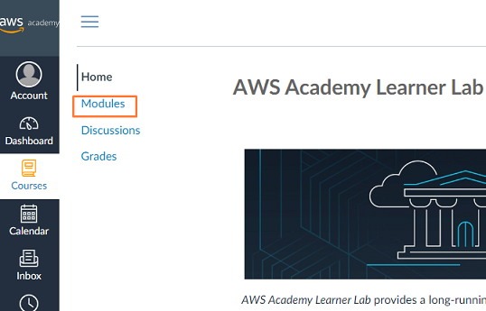
4.  Scroll down the page to find the section **AWS Academy Learner Lab**.
5.  Click on **Launch AWS Academy Learner Lab** link.

    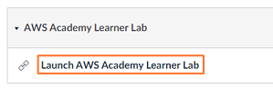
6.  To start the lab, click on the **Start Lab** button.

    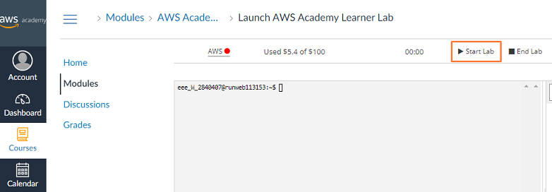  
7.  When the circle icon to the right of the AWS link in the upper left corner turns green, the lab environment is ready to use.
8.  To launch the AWS Management Console in a new tab, click on the **AWS** link.

    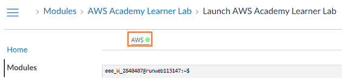  

## Task 2: Create AWS EC2 instance

1. Enter **ec2** at the top search bar and click on the first **EC2** link to go the EC2 console.
  
   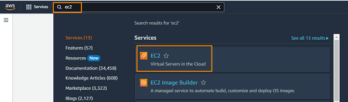

2. From the EC2 console dashboard, in the **Launch instance** box, click **Launch Instance**
    
    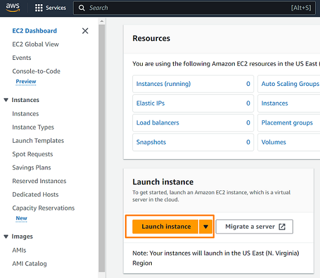  

3. Under **Name and tags**, for **Name**, enter a descriptive name for your instance. For example, **staycationX**.

4. Under **Application and OS Images (Amazon Machine Image)**, do the following:
    - Choose **Quick Start**, and then select **Ubuntu**
    - From **Amazon Machine Image (AMI)**, select **Ubuntu Server 22.04 LTS (HVM), SSD Volume Type** from the dropdown list.
    - Click **Confirm changes** when there is a prompt showing *Some of your current settings will be changed or removed if your proceed*.

    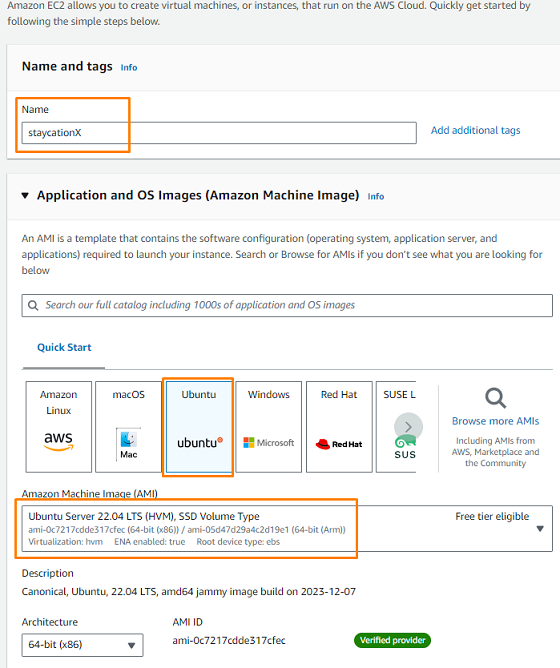

5. Under **Instance type**, from the Instance type list, select **t2.large**.

    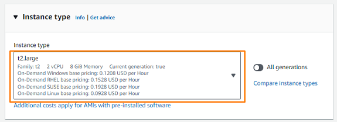 

6. Under **Key pair (login)**, for Key pair name, choose **vockey** from the dropdown list.

    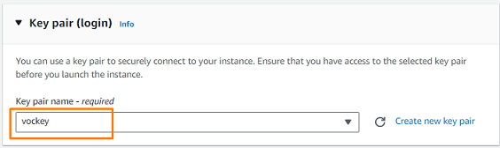

7. Under **Network Settings**, choose **Edit**. 
    - For **Security group name**, give it a name, for example, **staycationX-sg**
    - For **Description**, type **staycationX security group**
    - Under **Inbound Security Group Rules**, click **Add security group rule** to add the additional *2* rules:
        - Type: **HTTP**, Source type: **Anywhere**
        - Type: **Custom TCP**, Port range: **5000**, Source type: **Anywhere**
        - Type: **Custom TCP**, Port range: **27017**, Source type: **Anywhere**
    
    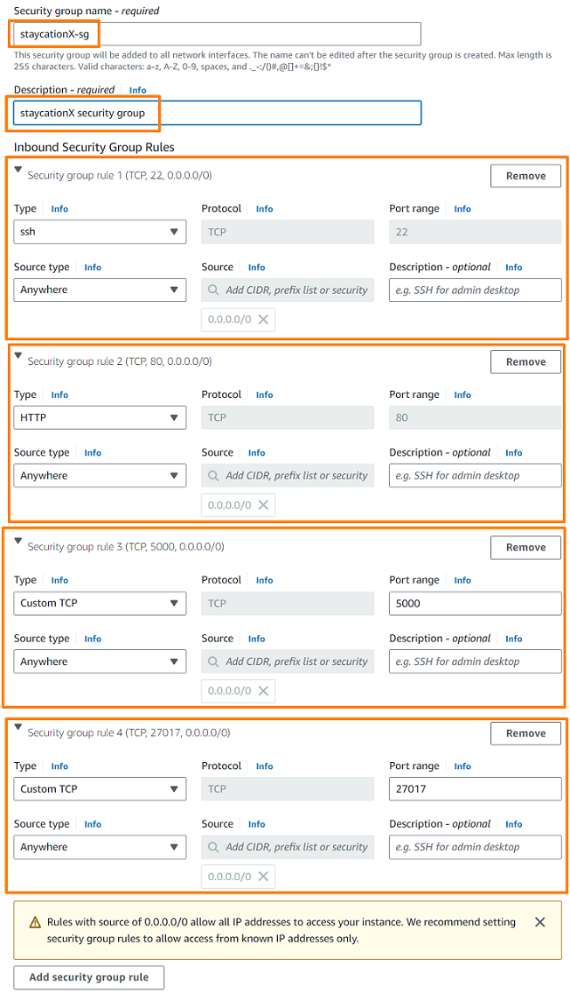
        
8. Under **Configure storage**, change the default value to **32**.

    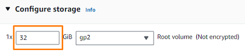

9. Keep the default selections for the other configuraton settings for your instance.

10. Review the summary of your instance configuration in the **Summary** panel and click **Launch instance** when you are ready to proceed.
    
    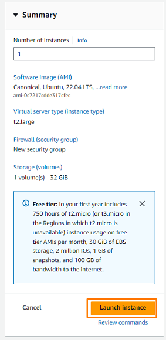

11. A confirmation page lets you know that your instance is launching. Choose **View all instances** to close the confirmation page and return to the console.

    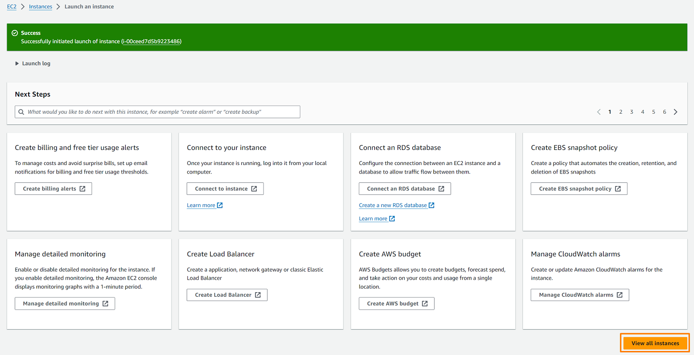


## Task 3: Accessing EC2 based on different platforms

Before you can access your EC2 instance, you will need to be able to:
1. Get information about your EC2 instance. 
    - Take note of the **IP address** of the EC2 instance which you will need to connect to the instance.

    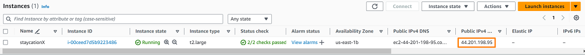
2. Locate your AWS EC2 private key pair.
    - Go to your Canvas page and click on **AWS Details**

      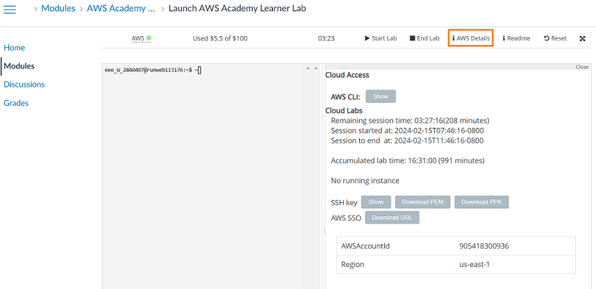

    ### For Windows
    
    - From the **AWS Details** section, click **Download PPK** to download the PPK file.

      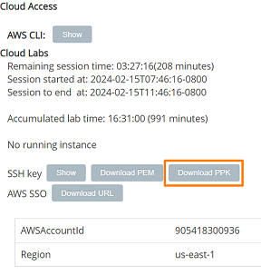
      
    - Open the **PuTTY client**.
    - Under the **Host Name (or IP address)** box, enter the **IP address** of the EC2 instance.

      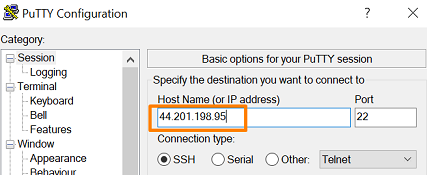        
    - On the left, there is a tree menu. Expand **SSH** followed by **Auth**.
    - Click **Credentials**.

      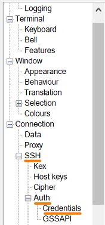
    - Under the **Public-key Authentication**, click on the **Browse** button to select the PPK file.
    - Point the path to the location of the downloaded PPK file.
    
      
    - Click on **Open** button.
    - In the **PuTTY Security Alert** prompt, click **Accept**.
    - Login to EC2 using the username **ubuntu**.
    - You should get the following screen if you have successfully connected to the EC2 instance.

      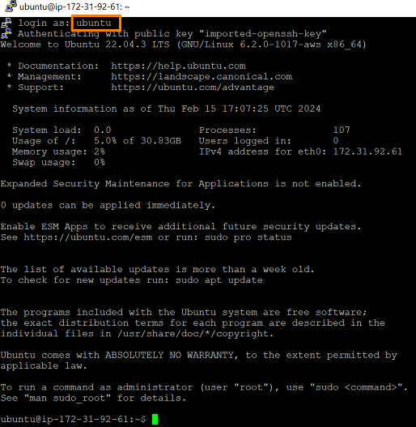


    ### For MacOS and Azure Lab Services

    - From the **AWS Details** section, click **Download PEM** to download the PEM file.

      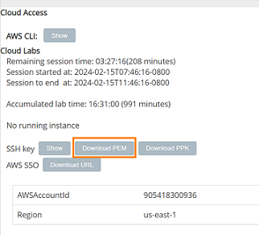

    - Open **Terminal** and point the path to the location of the downloaded PEM file.

    - Run the following to set the permissions of your PEM file so that only you can read it.
      ```
        chmod 400 labsuser.pem
      ```
    - Run the following SSH command to connect to the EC2 instance.
      ```
      # ssh -i labsuser.pem ubuntu@<EC2 IP address>
      # ssh -i labsuser.pem ubuntu@44.201.198.95
      ```
    - Enter **yes** to continue connecting.
    
    - You should get the following screen if you have successfully connected to the EC2 instance.

      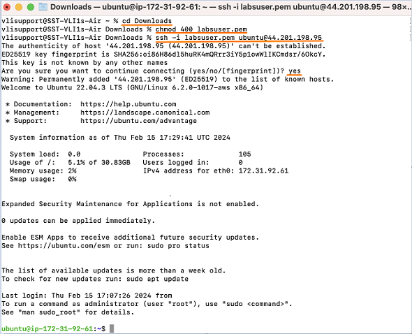


## Task 4: Install all the necessary software dependencies

The main tasks for this section are as follows:
1. Install pip and virtual environment
2. Install MongoDB Community Edition
3. Install docker and docker compose
4. Install MongoDB Compass
5. Install Nginx

To begin with the installation, please enter the following commands in the terminal or PuTTY client.

- Install pip and virtual environment
  ```
  sudo apt-get update
  sudo apt-get install python3-pip python3-venv -y
  ```

  When you encounter this screen, press **TAB** on the keyboard once and the cursor should be at the **Ok** button. Press **Enter** to continue.

  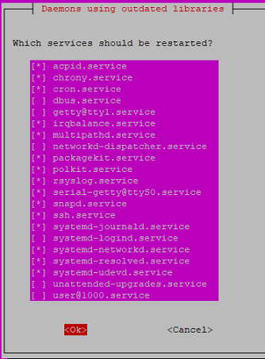

- Install MongoDB Community Edition

  ```
  sudo apt-get install gnupg curl -y
  curl -fsSL https://www.mongodb.org/static/pgp/server-7.0.asc | sudo gpg -o /usr/share/keyrings/mongodb-server-7.0.gpg --dearmor
  echo "deb [ arch=amd64,arm64 signed-by=/usr/share/keyrings/mongodb-server-7.0.gpg ] https://repo.mongodb.org/apt/ubuntu jammy/mongodb-org/7.0 multiverse" | sudo tee /etc/apt/sources.list.d/mongodb-org-7.0.list
  sudo apt-get update
  sudo apt-get install mongodb-org -y
  ```

  When you encounter this screen, press **TAB** on the keyboard once and the cursor should be at the **OK** button. Press **Enter** to continue.

  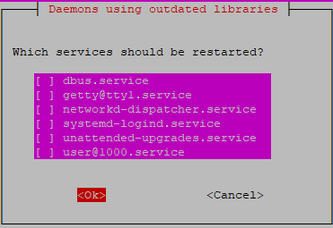

   
  To verify that MongoDB has been installed, enter the following:
  
  ```
  mongod --version
  ```
  
  You should get the following sample screenshot if you have successfully installed MongoDB.

  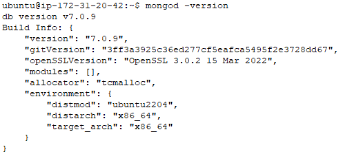

- Install docker and docker compose.
    
    * Run the following commands to install docker and docker compose.
      ```
      sudo apt-get update
      sudo apt-get install ca-certificates curl -y
      sudo install -m 0755 -d /etc/apt/keyrings
      sudo curl -fsSL https://download.docker.com/linux/ubuntu/gpg -o /etc/apt/keyrings/docker.asc
      sudo chmod a+r /etc/apt/keyrings/docker.asc

      echo "deb [arch=$(dpkg --print-architecture) signed-by=/etc/apt/keyrings/docker.asc] https://download.docker.com/linux/ubuntu \
      $(. /etc/os-release && echo "$VERSION_CODENAME") stable" | sudo tee /etc/apt/sources.list.d/docker.list > /dev/null
      sudo apt-get update

      sudo apt-get install docker-ce docker-ce-cli containerd.io docker-buildx-plugin docker-compose-plugin -y
      ```

    * Add the ubuntu user to the docker group, enter the following command:
  
      ```
      sudo usermod -aG docker ubuntu
      ```

    * Exit the current SSH session and re-connect to the EC2 instance using the same method as shown in Task 3.
      > **NOTE**: Do not miss this step otherwise you will encounter error message on the next step.
    
    * Verify that the ubuntu user is able to run docker commands by entering the following.
      ```
      docker info
      ```

      A sample screenshot is shown below if there is no error.

      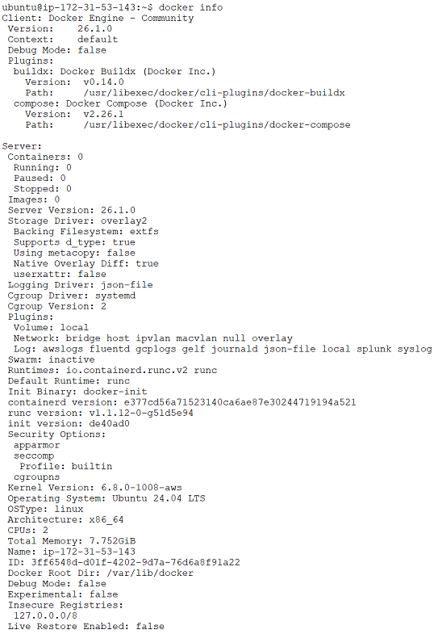

    * Verify that docker compose has been installed by entering the following command. It should return you a version number.
      ```
      docker compose version
      ```

        

- Install MongoDB Compass

  #### For Windows
  
    * Download MongoDB Compass from this [link](https://downloads.mongodb.com/compass/mongodb-compass-1.43.1-win32-x64.exe).

    * Run the installer and follow the on-screen instructions to install MongoDB Compass.
      > **NOTE**: The Compass installer will prompt you to install the minimum required version of the .NET framework if it is not already installed on your system.

  #### For Azure Lab Services

    * Run the following to install MongoDB Compass.

      ```
      wget https://downloads.mongodb.com/compass/mongodb-compass_1.43.1_amd64.deb
      sudo apt install ./mongodb-compass_1.43.1_amd64.deb -y
      sudo rm -rf mongodb-compass_1.43.1_amd64.deb
      ```
- Install Nginx
  
    * Run the following to install Nginx.
      ```
      sudo apt-get install nginx -y
      ```

    * To verify that Nginx has been installed, enter the following:
      ```
      nginx -v
      ```
      You should get the following sample screenshot if you have successfully installed Nginx.

      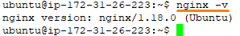

---

**Congratulations!** You have completed this lab exercise. Move on to the next exercise for deployment on virtual machines.
