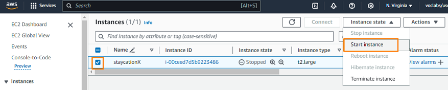
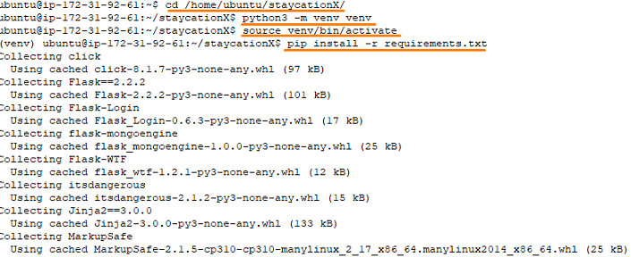
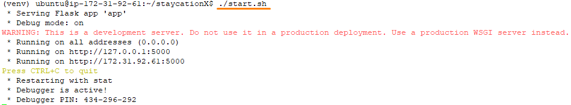
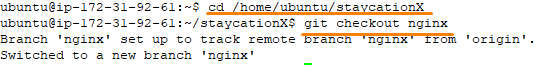
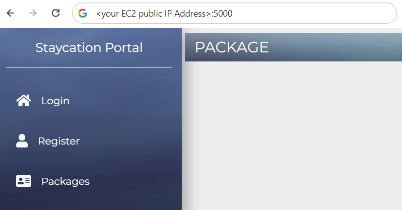

# Lab - Practice deploying StaycationX on Virtual Machine

This lab will guide you through the process of manually deploying the staycationX application on an EC2 instance in AWS.

## Pre-requisites
- Completed all the tasks in LAB_4A

## Instructions
The main tasks for this lab are as follows:
1. Starting the EC2 instance if it is not running
2. Downloading and installing Git Credential Manager in the EC2 instance
3. Cloning staycationX repository
4. Setting up virtual environment
5. Running the staycationX application with Flask
6. Checking out the nginx branch from the staycationX repository
7. Running the nginx branch of the staycationX application using gunicorn

## Task 1: Starting EC2 instance if it is not running

1.  From the EC2 console dashboard, in the **Resources** box, click on the **Instances** link.

2.  In the **Instances** page, select the instance with the name **staycationX**.

3.  Click **Instance state** and select **Start instance**.

    

4. Please allow some time for the EC2 instance to get started and running.

## Exercise 2: Generate SSH keys and add to Github

You can generate a SSH key in the EC2 instance and add the public key (`id_rsa.pub`) to your Github account.

Please refer to [Lab_0C Exercise 4](LAB_0C.md#exercise-4-github-ssh-keys) if you need the detailed steps.

## Task 3: Cloning staycationX repository

1. Change the current working directory to the location where you want the cloned directory. For example: /home/ubuntu

    ```bash
    cd /home/ubuntu
    ```

2. Run the following to clone your own staycationX repository.

    ```bash
    git clone git@github.com:USERNAME/staycationX
    ```

## Task 4: Setting up virtual environment

1.  Run the following to setup virtual environment.
    
    ```bash
    cd /home/ubuntu/staycationX
    python3 -m venv venv
    ```
2.  Install the python libraries in the virtual environment.
    
    ```bash
    source venv/bin/activate
    pip install -r requirements.txt
    ```

    

## Task 5: Running the staycationX application with Flask
1. Before running the application, you need to ensure that the MongoDB database is running. Run the following to start the MongoDB service.

    ```bash
    sudo systemctl start mongod
    ```

    > **TIP**: You can use the command **sudo systemctl status mongod** to check whether the service is running.

2. Start the staycationX application.

    ```bash
    ./start.sh
    ```
    

3. Ensure that there are no errors in terminal when starting the application.

4. To exit the running application, press `Ctrl+C` in terminal.

## Task 6: Checkout the nginx branch of the staycationX repository

1. Ensure that your current working directory is still at the /home/ubuntu/staycationX.
    
    ```bash
    cd /home/ubuntu/staycationX
    ```

2. Run the following to checkout the nginx branch of the staycationX repository.
   
   ```bash
   git checkout nginx
   ```

   

## Task 7: Running the nginx branch of the staycationX application using gunicorn

1. Install `gunicorn` in the virtual environment.

   ```bash
   pip install gunicorn
   ```

2. Run the staycationX application using gunicorn.

   ```bash
   gunicorn --bind :5000 -m 007 -e FLASK_ENV=development --workers 3 "app:create_app()"
   ```

3. To access the staycationX application, open a web browser and enter the public IP address of the EC2 instance followed by port `5000`.

   You should get the following sample screenshot.

   
   

7. To stop the running application, press `Ctrl+C` in terminal.


---

**Congratulations!** You have completed this lab exercise. Move on to the next exercise for deployment using containers.