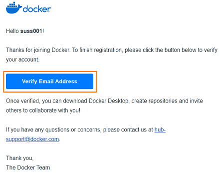
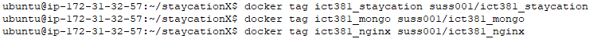
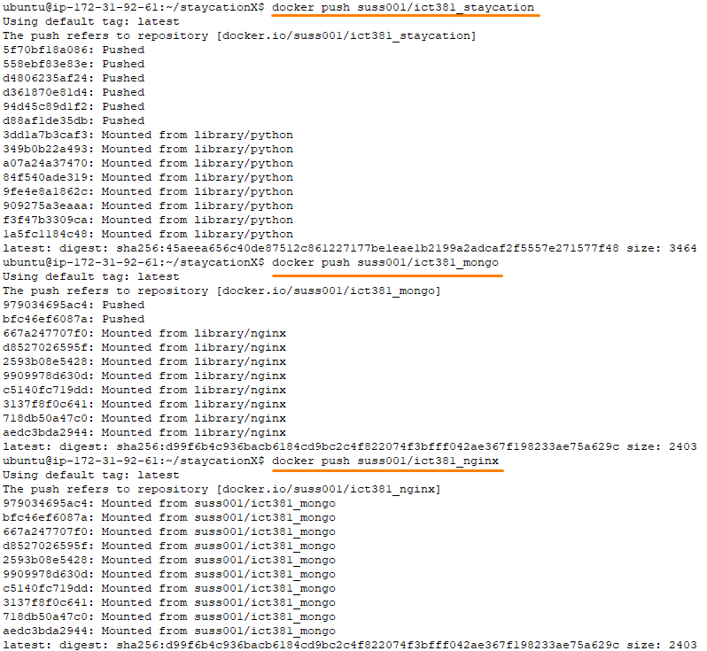

# Lab - Practice running StaycationX and ReactJS on Docker containers

This lab will guide you through the process of running the staycationX and ReactJS application on docker containers in an EC2 instance in AWS.

## Instructions
The main tasks for this lab are as follows:
1. Stopping Mongod service if it is running
2. Registering a Docker Hub account
3. Producing docker images from individual components of the staycationX application
4. Tagging and pushing your own container image to Docker Hub
5. Using Docker Compose to run containers
6. Accessing staycationX application on the web browser
7. Connecting to MongoDB using MongoDB Compass (Optional)
8. Running the ReactJS application with docker containers

## Task 1 : Stopping Mongod service if it is running

In order to prevent a port conflict between the local MongoDB database and the container's MongoDB database on port `27017`, we will stop the **mongod** service running on the EC2 instance.

```bash
sudo systemctl stop mongod
```

## Task 2: Registering a Docker Hub account

1. Navigate to docker hub website via this [link](https://hub.docker.com/signup).

2. Specify the following fields with these values and click **Sign Up**.

   |Field|Value|
   |---|---|
   |Email|Your SUSS email address|
   |Username| Your Student Portal User ID|
   |Password| Your preferred password|

3. Please login to docker hub with your newly created credentials.

4. On the **Docker Core susbscription page**, choose **Continue with Personal**.

   

5. Please check your email inbox for an email with the subject title **[Docker] Please confirm your email address**.

   

6. Click **Verify Email Address**.

   

7. After verification, sign in to docker hub with your credentials.

   

8. Upon successful login, you will be redirected to the docker hub dashboard.


## Task 3: Producing docker images from individual components of the staycationX application

In this task, you will produce docker images from individual components of the staycationX application. The components are as follows:

- staycationX
- MongoDB
- Nginx

To get started, please navigate to the staycationX folder. Please check that you are in the nginx branch.

```bash
cd /home/ubuntu/staycationX
git checkout nginx
```

In the folder, you will notice that there are several dockerfiles. We will use these dockerfiles to create docker images for each of the components.

- staycationX docker image
    - Run the following to build the docker image for the staycationX flask application.

      ```bash
      docker build -t ict381_staycation .
      ```

      


- MongoDB docker image
    - Run the following to build the docker image for mongodb.

      ```bash
      docker build -t ict381_mongo -f DockerfileMongo .
      ```

      


- Nginx docker image
    - Run the following to build the docker image for nginx.

      ```bash
      docker build -t ict381_nginx -f DockerfileNginx .
      ```

      


After creating the Docker images on your development machine, you can use the `docker compose` command to run the staycationX application. More information on the benefits of using Docker Compose can be found in Task 5.

*  Ensure that you are still in the staycationX folder of the nginx branch.

*  Run the `docker compose` command.

   ```bash
   docker compose up -d
   ```

   Docker Compose will read the configuration defined in the docker-compose.yml and start to execute the specified steps to setup and manage the multi-container application.

   The default path for a Docker Compose file is either `compose.yml` or `docker-compose.yml` that is placed within the working directory. If you have a different file name, you need to specify the file name using the `-f` flag. In example above, the file `docker-compose.yml` is being used.

## Task 4: Tagging and pushing your own container image to Docker Hub

Now, you have created the docker images for the staycationX application, MongoDB and Nginx. The next step is to tag and push the images to Docker Hub.

1. Tag the docker images with your docker hub username.

    ```bash
    docker tag ict381_staycation <your_docker_hub_username>/ict381_staycation
    docker tag ict381_mongo <your_docker_hub_username>/ict381_mongo
    docker tag ict381_nginx <your_docker_hub_username>/ict381_nginx
    ```

    A sample screenshot using the username **suss001** which was created earlier in Task 1.

    

2. Before you can push your docker image to docker hub, you would need to login to docker hub. Run the following to login to docker hub.

    ```bash
    docker login
    ```

    > **NOTE**: There is no visible indication of the characters being typed when you are keying your password. Please key in your password and press **Enter**.

    

3.  Push the docker images to Docker Hub.

    ```bash
    docker push <your_docker_hub_username>/ict381_staycation
    docker push <your_docker_hub_username>/ict381_mongo
    docker push <your_docker_hub_username>/ict381_nginx
    ```

    


## Task 5: Using Docker Compose to run containers

We will use docker compose to run the staycationX application.

Docker compose simplifies the management of multi-container applications by providing a single YAML configuration file. With a single command, one can create and start all the services specified in the configuration file, streamlining the development and deployment process.

In the staycationX folder under the nginx branch, we will inspect the file **dockerhub.yml** and insert your own docker id in the placeholder. Please save the file after editing.

To save the file, press `Ctrl+O` to save the contents and `Ctrl+X` to exit.

```bash
nano dockerhub.yml
```


A sample screenshot of the file with docker id **suss001** is shown below.


## Task 6: Accessing staycationX application on the web browser

Finally, we will run the staycationX application using docker compose. Enter the following to run the application.

```bash
docker compose -f dockerhub.yml up -d
```


> **TIP1**: To check the status of the docker compose, you can use the command **docker compose ps**
>
> 

> **TIP2**: To stop and remove the resources created by docker compose, you can use the command **docker compose down**
>
> 

To access the staycationX application, open a web browser and enter the **public IP address** of your EC2 instance.

You should get the following sample screenshot.


## Task 7: Connecting to MongoDB using MongoDB Compass (Optional)

1. Open the MongoDB Compass application.

2. Change the URI to be mongodb://`<your EC2 IP address>`:27017.

3. Click **Connect**.

   

4. Ensure you can connect to MongoDB successfully.

---

## Task 8: Running the ReactJS application with docker containers

Next, we will explore building and deploying the ReactJS application, which serves as the frontend for the StaycationX application. The ReactJS frontend communicates with the StaycationX backend through API calls to fetch required data. Therefore, in the `docker-compose.yaml` file, you will notice references to both the StaycationX application and the MongoDB database.

To start building the ReactJS docker image, please do the following.

1. Navigate to the home folder and clone the **OneMap** branch of the myReactApp repository.

    ```bash
    cd /home/ubuntu/
    git clone -b OneMap git@github.com:USERNAME/myReactApp
    ```

2. Navigate to the myReactApp folder.

    ```bash
    cd /home/ubuntu/myReactApp
    ```

3. Build the ReactJS docker image.

    ```bash
    docker build -f DockerfileReact -t ict381_nginx_react .
    ```

4. Once the docker image is built, you can run the ReactJS application using Docker Compose.

    ```bash
    docker-compose up -d
    ```

5. Open your web browser and enter **localhost** on the address bar.

6. You should see the ReactJS application running.

7. Click on the **STX** button.

8. Before you can login, you will need to register for an admin account for the StaycationX app (http://localhost:5000) first. After logging in, you will need to upload the staycation packages and user CSV files.

9. Return to the ReactJS app and login with the admin account credentials you have created.

10. You should see the list of all staycation packages.

    

11. To stop and remove the resources created by Docker Compose, you can use the command **docker compose down**.

    ```bash
    docker compose down
    ```

---

**Congratulations!** You have successfully run the staycationX and ReactJS application on Docker containers in an EC2 instance in AWS. You have also pushed your own docker images to Docker Hub.