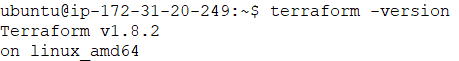
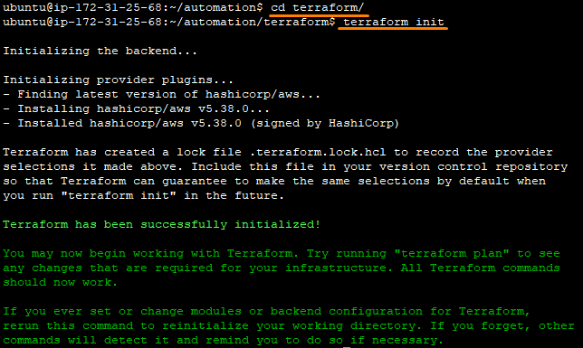
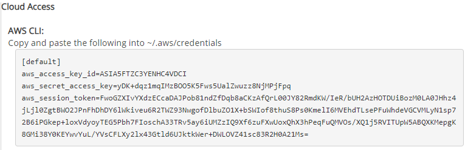
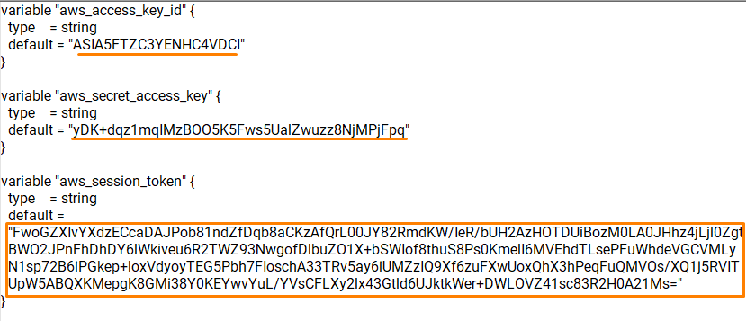
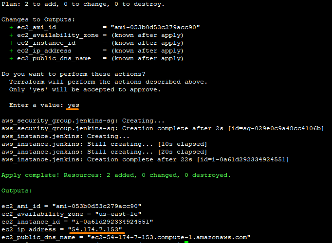

# Lab - Automate provisioning virtual servers using Terraform

This lab will guide you through the process of downloading and installing Terraform in your development environment. After which, Terraform will be used to create an EC2 instance in the AWS Learner Lab automatically.


## Instructions
The main tasks for this lab are as follows:
1. Download and install Terraform
2. Cloning the automation repository
3. Initialize Terraform
4. Retreive the AWS access key and secret key
5. Apply Terraform configuration

## Task 1: Download and install Terraform

1. Open **Terminal**.

2. Enter the following to download and install Terraform.
   ```bash
   wget -O- https://apt.releases.hashicorp.com/gpg | \
   sudo gpg --dearmor | \
   sudo tee /usr/share/keyrings/hashicorp-archive-keyring.gpg > /dev/null

   echo "deb [signed-by=/usr/share/keyrings/hashicorp-archive-keyring.gpg] \
   https://apt.releases.hashicorp.com $(lsb_release -cs) main" | \
   sudo tee /etc/apt/sources.list.d/hashicorp.list

   sudo apt update
   sudo apt-get install terraform -y
   ```

3. Verify the installation by entering the following:

   ```bash
   terraform -version
   ```

   A sample screenshot of the Terraform version.

   

> Maybe add in task to ask user to generate their own private/public key.

## Task 2: Cloning the automation repository

1.  Change the current working directory to the location where you want the cloned directory to be located.

    ```bash
    cd /home/ubuntu
    ```
2.  Run the following to clone your own `automation` repository.

    ```bash
    git clone git@github.com:USERNAME/automation
    ```

    NOTE: If you have not clone the course automation repository, please refer to [Lab_0C exercise 7](LAB_0C.md#exercise-7-mirror-repositories-to-your-own-repository) to clone your own repository.

3.  Change the current working directory to the cloned automation directory.

    ```bash
    cd automation
    ```

## Task 3: Initialize Terraform

1. Navigate to the `terraform` directory, run the following to initialize a Terraform working directory.

    ```bash
    cd terraform
    terraform init
    ```

    

## Task 4: Retrieve the AWS access key and secret key

1. Go back to the AWS Academy LMS.

2. Click on **AWS Details** at the top right hand corner of the header bar.

3. Click on the **Show** button to reveal the `Access Key` and `Secret Key` and `Session Token`.

   

4. Copy the `Access Key` and `Secret Key` and `Session Token` values and replace the placeholders in the **variables.tf** file respectively.

   A sample screenshot of the `variables.tf` file is shown below.

   


## Task 5: Apply Terraform configuration

1. Run the following to apply the Terraform configuration.

    ```bash
    terraform apply
    ```

2. Enter **yes** to confirm the action.

   > **TIP**: You can use the command **terraform apply --auto-approve** to apply the changes defined in the Terraform configuration files to the infrastructure without requiring manual confirmation.

3. You should be able to see the output of your EC2 IP address.

   

    > **TIP**: Please take note of the IP address. It will be used in the next lab to automatically configure the EC2 instance using Ansible.

---

Please take a moment to look at the Terraform source code that was used to provision the Delivery Virtual Server (Jenkins).

You can find the Terraform source code in the `automation` repository. Go to the terraform directory and open the file (`main.tf`) for viewing.

---

**Congratulations!** You have completed the lab exercise. Move on to the next exercise for configuring the EC2 instance using Ansible.