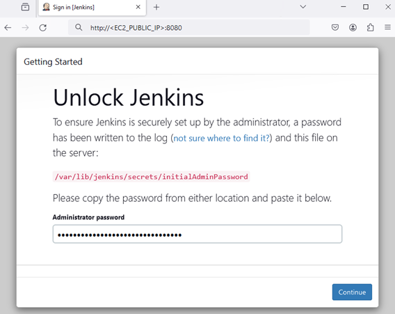

# Lab - Automate configuring virtual servers using Ansible

This lab will guide you through the process of downloading and installing Ansible in your development environment. After which, ansible will be used to configure the EC2 instance which was created by Terraform in the previous lab.

## Pre-requisites
1. Completed all the tasks in LAB_5A

## Instructions
1. Install Ansible
2. Run the Ansible playbook to install the required packages automatically
3. Testing of Deployed StaycationX
4. Configuration of SSH and AWS credentials for jenkins EC2 machine
5. Configuration of Ansible files
6. Accessing Jenkins on the browser

## Task 1: Install Ansible

1. Open **Terminal** in your development environment.

2. Run the following to install ansible.
   ```bash
   sudo apt-get install ansible -y
   ```

3. Verify the installation by entering the following:
   ```bash
   ansible --version
   ```

   

## Task 2: Run the Ansible playbook to install the required packages automatically

1. Change the current working directory to the `local-ansible` directory

   ```bash
   cd /home/ubuntu/automation/local-ansible
   ```

2. Navigate to the AWS Academy Canvas LMS and click **Show** SSH key.
      - Highlight and copy the private key contents
      - Open the labsuser.pem file
        ```bash
        nano labsuser.pem
        ```
      - Paste (by using your mouse right click) the private key contents into the file.
      - Press **Ctrl+O** to save the file and press **Enter** to leave the filename as default.
      - Press **Ctrl+X** close the file.

3. Run the following command to change the permissions of the PEM file to readonly.

   ```bash
   chmod 400 labsuser.pem
   ```

4. Open the **inventory** file and insert the EC2 IP address on line 2.

   -  Open the application.yaml file
      ```bash
      nano inventory
      ```
   - Insert the EC2 IP address on line 2. The IP address is obtained from the last step of LAB_5A.
   - Press **Ctrl+O** to save the file and press **Enter** to leave the filename as default.
   - Press **Ctrl+X** close the file.

5. Add the EC2 IP address to the list of known hosts.

   ```bash
   ssh-keyscan -t rsa <EC2_PUBLIC_IP> >> /home/ubuntu/.ssh/known_hosts
   ```

   Replace `<EC2_PUBLIC_IP>` with the public IP address of your EC2 instance.

6. Please take a moment to review the ansible playbook file (`application.yaml`) to understand the tasks that will be executed.

7. In the `application.yaml` file, for the last third task on cloning the staycationX repository, please replace the USERNAME field with your own GitHub username. Please save and close the file after editing.

8. Use the ansible playbook command to run the `application.yaml` playbook file.
   ```bash
   ansible-playbook application.yaml
   ```
   
9. Ensure that you do not have any errors at the end of the execution.

   

   > **TIP**: To get a more verbose output, you can use the `-v` flag. You can use `-vv` or `-vvv` for more verbosity.
   > For example: `ansible-playbook -vv application.yaml`.

10. Please refer to the source code for the ansible playbook. You can find the playbook at the `automation` repository. Navigate to the `local-ansible` folder and look at the `application.yaml` file.
   

---

The following tasks in the section below are to be performed on the EC2 instance deployed by Terraform in LAB_5A.

## Task 3: Testing of deployed StaycationX

### Step 1: Connecting to mongoDB container to seed data

1. Change the current path  to the staycationX directory in `/opt`.

   ```
   cd /opt/staycationX
   ```

2. Run the following command to display the status of containers defined in the docker compose file.
   
   ```bash
   docker-compose ps
   ```

   You should be able to see `3` containers.

   

3. Before testing can be done, seeding of data is required. Seeding refers to the process of populating a database with initial data that is necessary for testing or development purposes.

   To seed the data, we need to first connect to the mongo database container.

   To connect to the database container, run the following command:

   ```bash
   docker exec -ti staycationx_db_1 /bin/bash
   ```

4. Once connection is successful, run the following command to restore the mongoDB database from a binary backup that has been pre-prepared.

   ```bash
   mongorestore --nsInclude 'staycation.*' /opt
   ```

5. Once seeding is completed, you should see the message showing `66` documents restored.

   

6. Enter **exit** to exit the mongoDB container.


### Step 2: Connect to the staycation application container to perform testing.

1. Run the following to connect to the staycation container.
   
   ```bash
   docker exec -ti staycationx_frontend_1 /bin/bash
   ```

2. Set the following environment variables.
   -  MOZ_HEADLESS
   -  PYTHONPATH

   MOZ_HEADLESS is used in Firefox browser to enable headless mode. Headless mode allows Firefox to run without graphics interface, making it suitable for automated testing in a headless environment.

   PYTHONPATH is used to specify additional directories where Python should look for modules and packages.

   Run the following to export the environment variables.

   ```bash
   export MOZ_HEADLESS=1
   export PYTHONPATH=.
   ```

3. Run pytest from the root directory of the staycation app. pytest will automatically discover and run the defined test cases.

   ```bash
   pytest -s -v
   ```

4. You should see that the test results indicate that all test cases have passed.

   

5. Enter **exit** to exit the container.


## Task 4: Configuration of SSH and AWS credentials for jenkins EC2 machine

#### AWS credentials

1. You will need to create a file to store your AWS credentials in the jenkins folder.

2. Before that, you would need to create the `.aws` directory in the jenkins and ubuntu folder.

   ```bash
   mkdir /home/ubuntu/.aws
   sudo mkdir /var/lib/jenkins/.aws
   ```

3. Navigate back to AWS Academy Canvas LMS and click **AWS Details** at the top right hand corner of the header bar.

4. Under AWS CLI, click on the **Show** button.

5. Highlight and copy the contents in the box.

5. Navigate back to the terminal and run the following command:

   ```bash
   vi /home/ubuntu/.aws/credentials
   ```

6. Paste (by using your mouse right click) the contents into the file.

7. Press **ESC**

8. Type **:wq** and press **Enter** to save and close the file.

9. Copy the credentials file to jenkins `.ssh` folder.

   ```bash
   sudo cp /home/ubuntu/.aws/credentials /var/lib/jenkins/.aws/credentials
   ```

   > **NOTE**: Please perform these step at the start of each new lab session as the AWS credentials changes for every session.

#### SSH credentials

1. You will need to create a file to store your SSH credentials in the jenkins folder.

2. Navigate back to AWS Academy Canvas LMS and click **Show** SSH key.

3. Highlight and copy the private key contents.

4. Navigate back to the terminal and run the following command:

   ```bash
   sudo vi /var/lib/jenkins/.ssh/vockey
   ```

5. Paste (by using your mouse right click) the private key contents into the file.

6. Press **ESC**

7. Type **:wq** and press **Enter** to save and close the file.

8. After the above has been completed, we will change the permissions of the files to ensure that the owner of the files belongs to the jenkins user.

   ```bash
   sudo chown -R jenkins:jenkins /var/lib/jenkins/.aws/
   sudo chown -R jenkins:jenkins /var/lib/jenkins/.ssh/
   sudo chmod 400 /var/lib/jenkins/.ssh/vockey
   ```

## Task 5: Configuration of Ansible files

- Create the following files with the following contents.

   1. Create the `ansible.cfg` file in the `/etc/ansible` directory.

      ```bash
      sudo mkdir /etc/ansible
      sudo vi /etc/ansible/ansible.cfg
      ```

      Add the following contents to the file.

      ```bash
      [defaults]
      host_key_checking = False

      [ssh_connection]
      retries = 10
      ```

      Press **ESC**

      Type **:wq** and press **Enter** to save and close the file.


   2. Create the `aws_ec2.yaml` file in the `/etc/ansible` directory.

      ```bash
      sudo vi /etc/ansible/aws_ec2.yaml
      ```

      Add the following contents to the file.

      ```bash
      plugin: amazon.aws.aws_ec2
      regions:
        - us-east-1
      strict: False
      keyed_groups:
        - key: 'tags'
          prefix: tag
      compose:
         ansible_host: ip_address
      ```

      Press **ESC**

      Type **:wq** and press **Enter** to save and close the file.


   3. Create the `tag_group_web.yaml` file in the `/etc/ansible` directory.

      ```bash
      sudo mkdir /etc/ansible/group_vars
      sudo vi /etc/ansible/group_vars/tag_group_web.yaml
      ```

      Add the following contents to the file.

      ```bash
      ansible_ssh_private_key_file: /var/lib/jenkins/.ssh/vockey
      ansible_user: ubuntu
      ```

      Press **ESC**

      Type **:wq** and press **Enter** to save and close the file.

## Task 6: Accessing Jenkins on the browser

In this task, we will be accessing Jenkins on the browser to create our first user and installing the required plugins.

1. Open a new browser tab and enter the following URL:

   ```bash
   http://<EC2_PUBLIC_IP>:8080
   ```

   Replace `<EC2_PUBLIC_IP>` with the public IP address of your EC2 instance.

2. You will be prompted to enter the initial admin password. Run the following command to retrieve the initial admin password.

   ```bash
   sudo cat /var/lib/jenkins/secrets/initialAdminPassword
   ```

   


3. Copy the password and paste it into the **Administrator password** field. Click **Continue** to proceed.

   

4.  Under Customize Jenkins, click **Install suggested plugins**.

    

5. Wait for the installation to complete.

6. On the **Create First Admin User** page, enter the following:

   |Field|Value|
   |---|---|
   |Username| Your Student Portal User ID|
   |Password| Your preferred password|
   |Confirm Password| Your preferred password|
   |Full Name| Your full name|
   |Email Address| Your SUSS email address|

7. Click **Save and Continue**.

8. On the **Instance Configuration** page, click **Save and Finish**.

   

9. On the **Jenkins is ready!** page, click **Start using Jenkins**.

   

10. You will be redirected to the Jenkins dashboard.

    

---

**Congratulations!** You have completed the lab exercise. Move on to the next exercise to learn more about creating pipelines with Jenkins.