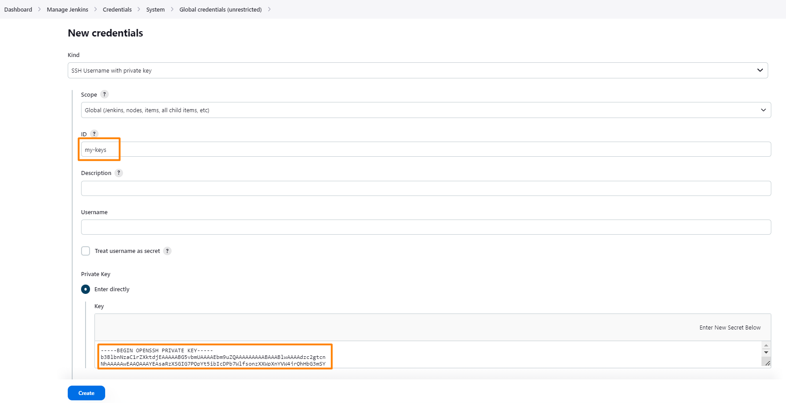
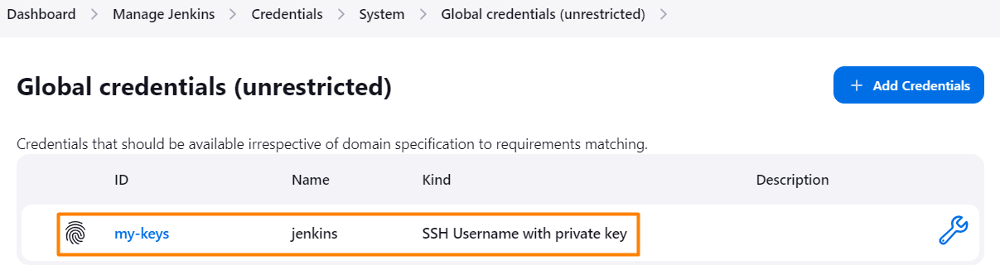

# Lab - Provisioning and Configuration of Jenkins

This lab will guide you through the process of configuring Jenkins in the EC2 instance.

## Pre-requisites
1. Completed all the tasks in LAB_5A and LAB_5B

## Instructions
1. Adding SSH key to Jenkins to access the repository
2. Saving all the changes to the automation repository
3. Creating the Jenkins Pipeline
4. Running the Jenkins Pipeline
5. Creating and configuring webhook in Github
6. Configure Jenkins to trigger a build when a new commit is pushed to the repository

## Task 1: Adding SSH key to Jenkins to access the repository

1. From the Jenkins dashboard, click on **Manage Jenkins** located on the left menu.

2. Click on **Credentials** under the Security section.

3. Click on the **global** link.

4. Click **+ Add Credentials**.

5. Under **Kind**, select **SSH Username with private key**.

6. Under **ID**, enter `my-keys`.

7. Under **Private Key**, select **Enter Directly**.

8. Click **Add**.

9. Paste in the contents of the private key file `id_rsa`.

   

10. Click **Create**.
    
11. You should see the credentials added to Jenkins.

    

## Task 2: Saving all the changes to the automation repository

Please save and push changes to your `automation` repository before proceeding, as the Jenkins pipeline relies on these files.

## Task 3: Creating the Jenkins Pipeline

1. Click on the Jenkins logo on the top left to show the Dashboard.

2. Click **+ New Item** on the left menu shown in the Dashboard.

3. Under item name, give it a name: `pipeline1`.

4. Select **Pipeline** and click **OK**.

5. Under **Pipeline** section, choose **Pipeline script from SCM** from the Definition drop down list.

6. Select **Git** from the SCM dropdown list.

7. Under Repository URL, enter your Git repository in this format: `git@github.com:USERNAME/automation`.

8. Under Credentials, select **jenkins** from the Credentials dropdown list.

9. Under Credentials, select **jenkins**.

10. Under the branch specifier, enter the branch name: `*/main`.

11. Leave the rest as default and scroll down to the end of page and click **Save**.

## Task 4: Running the Jenkins Pipeline

1. Click on **Build Now** on the left menu of the pipeline.
   > **NOTE**: The Build Now button appear once. The subsequent button text will be Build with Parameters.

2. Under Build History box, click on the Build Run # number to view more information.

3. You can click on the **Console Output** to view the build process.

4. If the build is successful, you should see a green tick on the left of the build number.

## Task 5: Creating and configuring webhook in Github

1. Navigate to your Github `automation` repository.

2. Click on the **Settings** tab.

3. Under **Code and automation** section on the left, click **Webhooks**.

4. Click on **Add webhook**.

5. Enter the following details:
   - Payload URL: `http://<EC2_PUBLIC_IP>:8080/github-webhook/`
     > Replace the EC2_PUBLIC_IP with the jenkins machine public IP address
   - Content type: `application/json`
   - SSL verification: **Disable**
   - Which events would you like to trigger this webhook? Select `Just the push event`.

6. Click **Add webhook** to save the webhook.

7. You should see the webhook added to the repository.

Repeat the above steps for the `StaycationX` repository.

## Task 6: Configure Jenkins to trigger a build when a new commit is pushed to the repository

1. From the Jenkins dashboard, click on your created pipeline.

2. Click on **Configure** on the left menu.

3. Under the **Build Trigger** section, select **GitHub hook trigger for GITScm polling**.

4. Click **Save** at the bottom of the page.

To simulate the trigger, please make changes to the files and push it to your own Github repository.

You should see a new build being triggered in Jenkins automatically under the Build History box.

A quick way to verify:

*  Create an empty space in the `README.md` file in the `automation` repo.
*  Save and push the changes back to your own repository.
*  You should notice a new build being triggered automatically.

> **IMPORTANT**: Please ensure that the docker image versioning in both `build-docker.yaml` (from automation repo) and `dockerhub.yaml` (from StaycationX repo) matches.

Visit the webpage to view the changes!

---

**Congratulations!** You have completed the lab exercise.