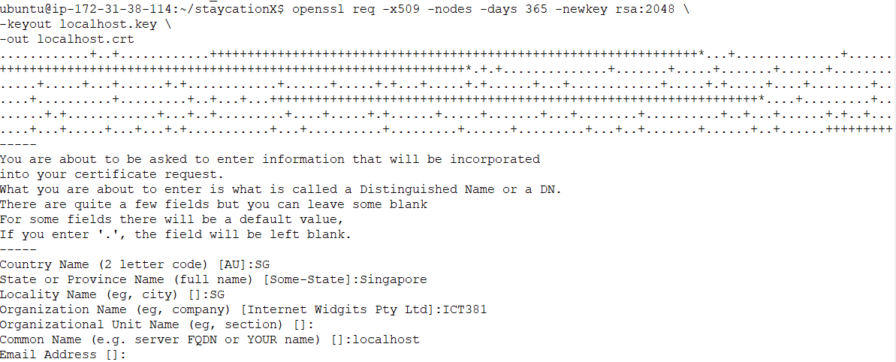
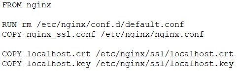
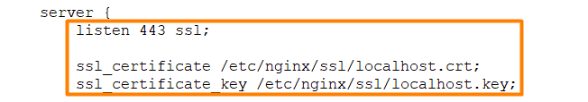
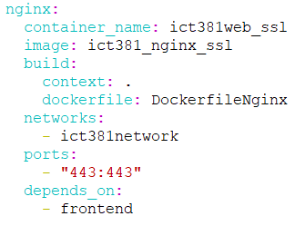
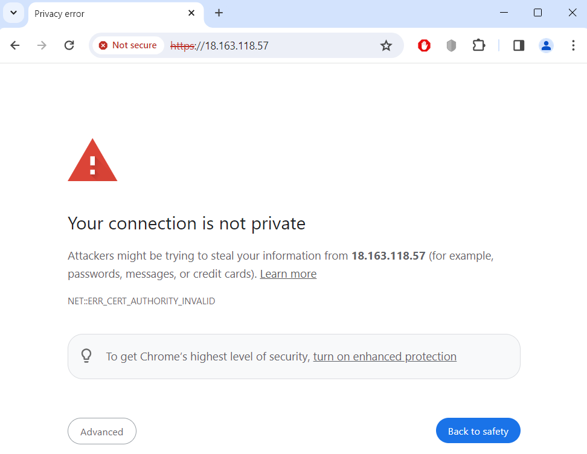
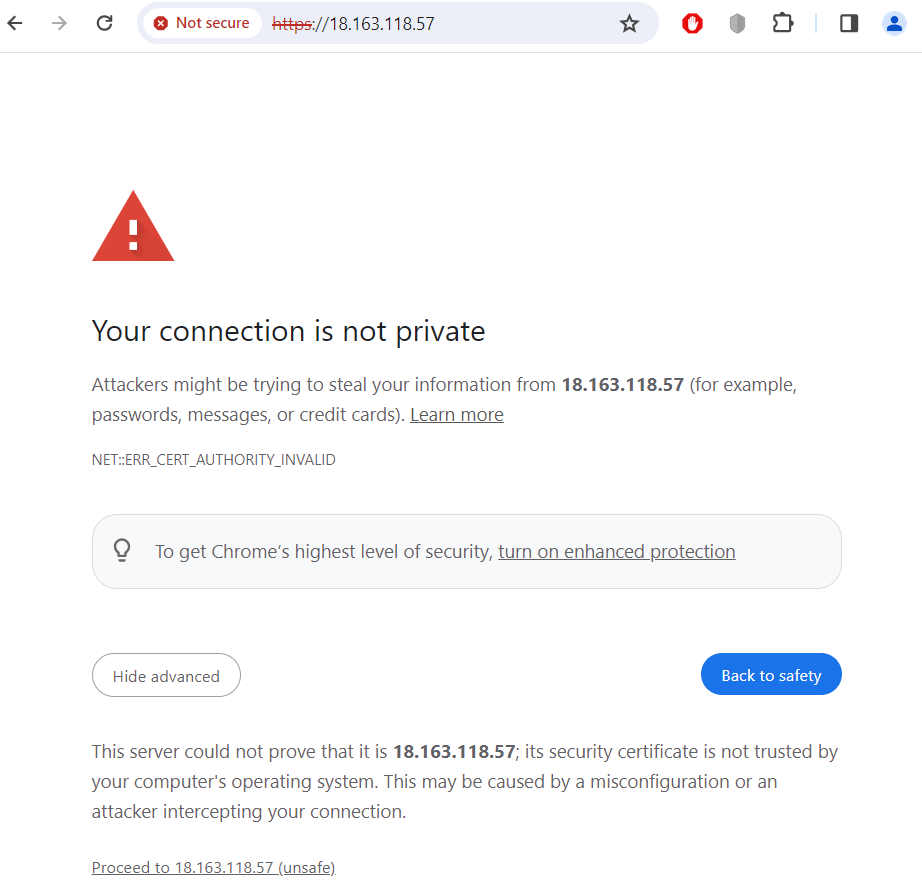
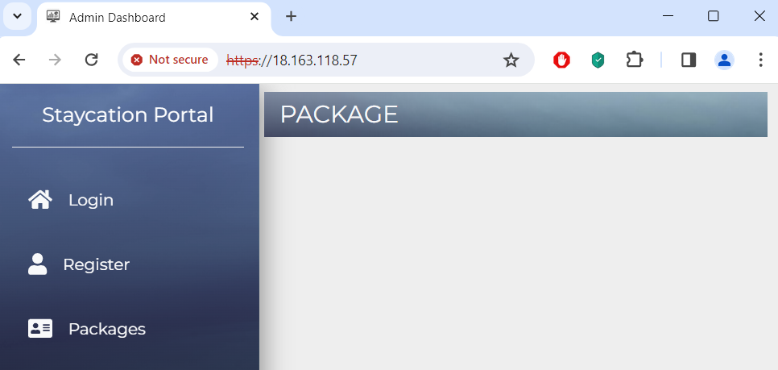
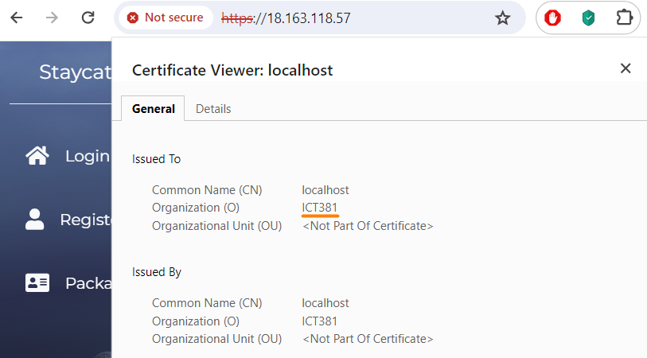

# Lab - Practice Nginx with SSL certificates

In this lab, you will learn to generate an SSL certificate and insert it into an Nginx Dockerfile. You will then build a Docker image with the Nginx configuration and run a container based on the image. This will enable you to serve your website securely over HTTPS.

## Instructions
1. Stopping your existing StaycationX docker containers
2. Creating self-signed SSL certificate
3. Modify Nginx Dockerfile
4. Review the nginx_ssl configuration file
5. Edit docker compose file
6. Run the docker compose file
7. View the website over HTTPS
8. Verify the SSL certificate

## Task 1: Stopping your existing StaycationX docker containers

Please follow the steps below to stop the existing docker containers if there are still existing docker containers running.

1. Login to the Jenkins EC2 instance.

2. Navigate to the `/opt/staycationX` directory.

    ```bash
    cd /opt/staycationX
    ```

3. Run the following command to stop the existing docker containers.

    ```bash
    sudo docker-compose down
    ```

## Task 2: Creating self-signed SSL certificate

1. Open **Terminal**.

2. Before we start creating the SSL certificate, switch to the `ssl` branch of the `staycationX` repository.

    ```bash
    cd /home/ubuntu
    git clone git@github.com:USERNAME/staycationX
    cd /home/ubuntu/staycationX
    git checkout ssl
    ```

3. Enter the following to generate a self-signed SSL certificate and key.

   ```bash
   openssl req -x509 -nodes -days 365 -newkey rsa:2048 \
   -keyout localhost.key \
   -out localhost.crt
   ```

   You will be prompted a series of questions. You can fill in the information as you see fit.

   


   This willl create `localhost.key` and `localhost.crt`.

## Task 3: Modify Nginx Dockerfile

1. Open the DockerfileNginx file.

   ```bash
   vim /home/ubuntu/staycationX/DockerfileNginx
   ```

3. Add the following contents at the end of the DockerfileNginx.

   ```Dockerfile
   COPY localhost.crt /etc/nginx/ssl/localhost.crt
   COPY localhost.key /etc/nginx/ssl/localhost.key
   ```

   The Dockerfile should look like this after completing the changes.

   

4. Save and exit the file.

4. (Optional) You may push the files to the `ssl` branch of your StaycationX repo.

## Task 4: Review the nginx_ssl configuration file

1. Open the `nginx_ssl.conf` file.

2. We need to include this specific configuration to setup SSL for secure communication.

   `listen 443 ssl;`: This line tells Nginx to listen for incoming connections on port 443, which is the standard port for HTTPS (HTTP over SSL/TLS). The ssl keyword indicates that this server block is configured to handle SSL connections.

   `ssl_certificate /etc/nginx/ssl/localhost.crt;`: This line specifies the location of the SSL certificate file for the server. This certificate is used to establish the secure connection and verify the server's identity to clients.

   `ssl_certificate_key /etc/nginx/ssl/localhost.key;`: This line specifies the location of the SSL certificate's private key. This key is used to decrypt the secure connection and verify the server's identity to clients.

   

## Task 5: Edit docker compose file

1. Open the `docker-compose.yml` file.

2. Under the **Nginx** service, replace the following fields:
   - container_name to `ict381web_ssl`
   - image to `ict381_nginx_ssl`
   - ports to `443:443`


   ```yaml
   nginx:
     container_name: ict381web_ssl
     image: ict381_nginx_ssl
     ports:
      - "443:443"
   ```
   The nginx section of the `docker-compose.yml` file should look like this after completing the changes.

   

3. Save the file and exit.

4. (Optional) Push the changes to the `ssl` branch of your StaycationX repo.

## Task 6: Run the docker compose file

1. Ensure that your current directory is pointed to the StaycationX directory.

   ```bash
   cd /home/ubuntu/staycationX
   ```

2. Run the following command to build the `ict381_nginx_ssl` image and run the containers.

   ```bash
   sudo docker-compose up -d
   ```

## Task 7: View the website over HTTPS 

You should now be able to access the NGINX server with the self-signed certificate by opening a web browser and navigating to https://`JENKINS-EC2-IP-ADDRESS`. Since it's a self-signed certificate, your browser might show a security warning. You can proceed to the site, but keep in mind that this certificate won't be trusted by default.



Click **Advanced** and then click **Proceed to <JENKINS-EC2-IP-ADDRESS> (unsafe)**.



The browser should display the StaycationX website with the HTTPS protocol.




> **TIP**: For production, you should use a trusted certificate authority (CA) to generate SSL certificates and configure NGINX accordingly. Self-signed certificates are not secure for production environments due to potential security risks.

## Task 8: Verify the SSL certificate

1. Click on **Not Secure** button on the Chrome browser URL bar.

2. Click **Certificate is not valid**.

3. Notice that the certificate is issued to `localhost` and the organization shows `ICT381` which was the value of what have been entered while generating the certificate.

   


---

**Congratulations!** You have completed the lab exercise.