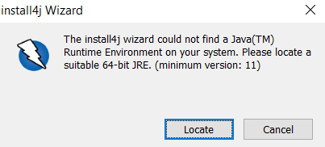
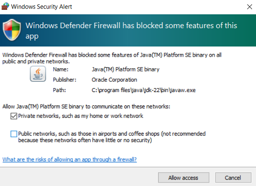
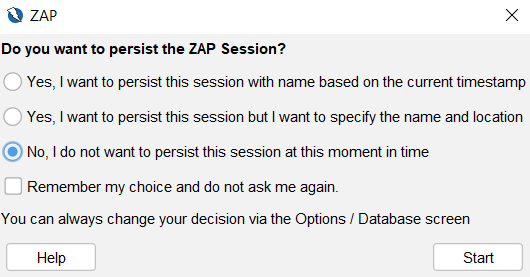
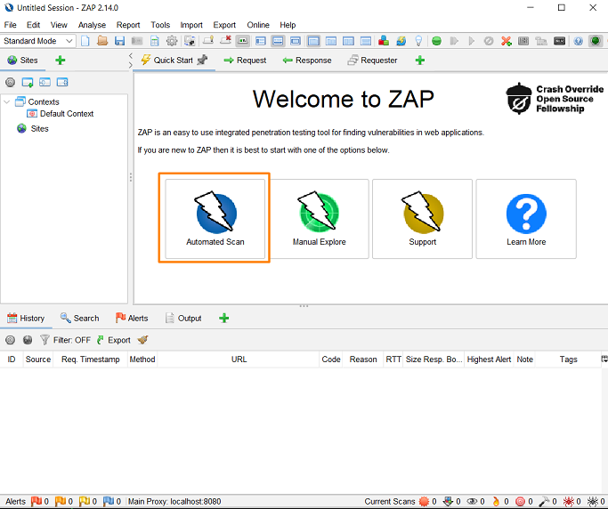
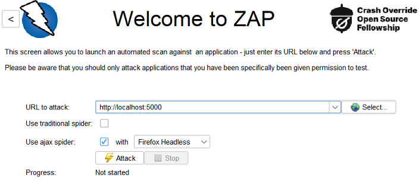

# Lab - Discovering XSS Vulnerabilities with ZAP

In this lab, we will explore how to use Zed Attack Proxy (ZAP) to discover Cross-Site Scripting (XSS) vulnerabilities in StaycationX application. XSS vulnerabilities can be a serious security risk, and it is important to understand how to detect and mitigate them.

> [!WARNING]
> Please be aware that scanning websites or web applications without proper authorization may violate ethical guidelines and legal regulations. Only use ZAP to test applications that you own or have explicit permission to assess, such as the StaycationX application in this lab scenario.

## Prerequisites:
- ZAP installed on your machine
- `xss` branch of the StaycationX application.
- StaycationX application running on your local machine.
- Java 11 or higher installed on your local machine.

## Instructions:
* Install ZAP on your machine
* Start StaycationX application
* Run ZAP

## Task 1: Install ZAP on your machine

### For Windows

1. Navigate to the ZAP [website](https://www.zaproxy.org/download/) to download the installer file.

2. Choose **Windows (64) installer**.

3. Launch the installer and follow on-screen instructions to install.

4. Should you encounter this screen, please ensure that you have already installed [Java](https://www.oracle.com/sg/java/technologies/downloads/) prior to launching the ZAP installer.

   

### For Azure Lab Services

1. Navigate to the ZAP [website](https://www.zaproxy.org/download/) to download the installer file.

2. Choose **Linux Installer**.

3. Run the shell script file in the terminal.

   ```bash
   ./ZAP.sh
   ```

## Task 2: Start StaycationX application

1. Clone the `xss` branch of the StaycationX application by running the following command:

   ```bash
   git clone -b xss git@github.com:USERNAME/staycationX
   ```

2. Start the StaycationX application by running the following command:
  
   ```bash
   cd staycationX
   ./start.sh
   ```

## Task 3: Run ZAP

1. Launch the ZAP application on your local machine.

2. Should you encounter the Windows Security alert, please do the following:
   -  **Select** Private networks, such as my home or work network
   -  **Un-check** Public Networks, such as those in airports and coffeeshop
   -  Click Allow Access

   

3. On **Do you want to persist the ZAP session** prompt, select **No, I do not want to persist this session at this moment in time**.

   

4. Click **Start** to proceed.

5. Click **Automated Scan** on the main menu.

   

6. Ensure the following settings are configured.

   |Field|Value|
   |---|---|
   |URL to attack| http://localhost:5000|
   |Use traditional spider| Uncheck this option|
   |Use ajax spider| Check this option and select **Firefox Headless** from dropdown list|

   

7. Click **Attack** button to scan StaycationX application.

8. Please allow some time for the scanning.
   > Grab a cup of coffee and come back later.


